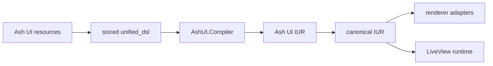

# Ash UI

Ash UI is a resource-backed UI framework for Elixir built on Ash. It stores screens, elements, and bindings as Ash data, compiles them into an internal IUR, converts that structure into canonical renderer input, and wires the result into LiveView-oriented runtime helpers.

## What Works Today

- persisted `Screen`, `Element`, and `Binding` resources in `AshUI.Domain`
- `unified_dsl` storage and builder helpers through `AshUI.DSL.Builder`
- compilation to `AshUI.Compilation.IUR` through `AshUI.Compiler`
- canonical conversion through `AshUI.Rendering.IURAdapter`
- LiveView mount, event, and update integration helpers
- runtime authorization policies and checks
- normalized telemetry events, in-memory metrics, and dashboard definitions

## Architecture at a Glance



## Quick Start

Add the core dependencies:

```elixir
defp deps do
  [
    {:ash_ui, "~> 0.1.0"},
    {:ash, "~> 3.0"},
    {:ash_postgres, "~> 2.0"},
    {:phoenix_live_view, "~> 1.0"},
    {:telemetry, "~> 1.0"}
  ]
end
```

Create a screen record:

```elixir
alias AshUI.DSL.Builder
alias AshUI.Domain
alias AshUI.Resources.Screen

{:ok, _screen} =
  Domain.create(Screen,
    attrs: %{
      name: "dashboard",
      route: "/dashboard",
      layout: :column,
      unified_dsl:
        Builder.column(
          children: [
            Builder.text("Dashboard", size: 24, weight: :bold),
            Builder.button("Refresh", on_click: "refresh-dashboard")
          ]
        )
        |> Builder.to_store()
    }
  )
```

Mount it in LiveView:

```elixir
defmodule MyAppWeb.DashboardLive do
  use MyAppWeb, :live_view

  alias AshUI.LiveView.Integration

  def mount(_params, _session, socket) do
    socket = assign(socket, :current_user, %{id: "admin-1", role: :admin, active: true})
    Integration.mount_ui_screen(socket, :dashboard, %{})
  end
end
```

## Renderer Status

Ash UI owns the compiler, runtime, and adapter boundary. External renderer packages such as `live_ui`, `web_ui`, and `desktop_ui` are optional at the moment. When they are not present, Ash UI uses fallback adapter behavior so compile, integration, and telemetry flows remain testable.

## Documentation

- [User guides](/Users/Pascal/code/ash/ash_ui/guides/user/README.md)
- [Developer guides](/Users/Pascal/code/ash/ash_ui/guides/developer/README.md)
- [Guide index](/Users/Pascal/code/ash/ash_ui/guides/README.md)
- [Specifications](/Users/Pascal/code/ash/ash_ui/specs/README.md)
- [RFCs](/Users/Pascal/code/ash/ash_ui/rfcs/README.md)

Key starting points:

- [UG-0001: Getting Started](/Users/Pascal/code/ash/ash_ui/guides/user/UG-0001-getting-started.md)
- [DG-0001: Architecture Overview](/Users/Pascal/code/ash/ash_ui/guides/developer/DG-0001-architecture-overview.md)
- [Example: basic dashboard](/Users/Pascal/code/ash/ash_ui/examples/basic_dashboard/README.md)

## Current Phase

The project is in Phase 8, focused on governance gates and release readiness. CI, conformance coverage, observability, and documentation are now first-class parts of the repo instead of placeholders.

## Development Notes

- compiler cache lives in ETS and is initialized at application start
- authorization runtime also uses ETS-backed caching
- telemetry events are aggregated through `AshUI.Telemetry.snapshot/0`
- dashboard definitions live in `priv/monitoring/dashboards/`

## License

[License to be determined]
