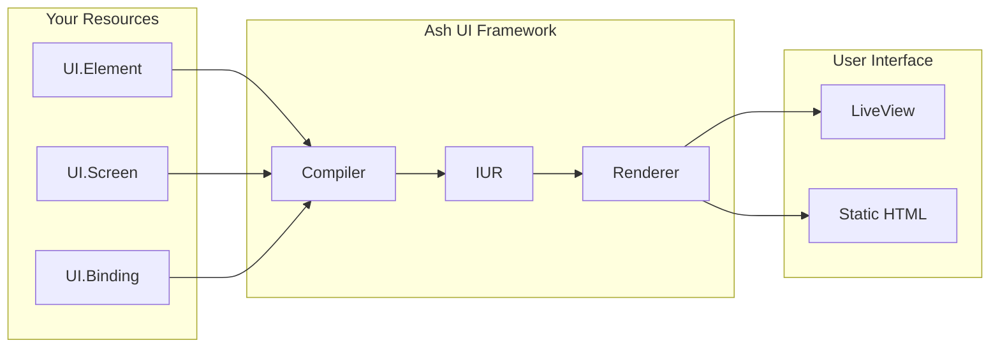

# Ash UI

A resource-driven UI framework for Elixir built on the Ash Framework, enabling dynamic UI generation from database resources through Phoenix LiveView and static web rendering.

## Overview

Ash UI provides a declarative approach to building user interfaces by defining UI components as Ash resources. This enables:

- **Database-Driven UI** - Define screens and elements as resources
- **Reactive Data Binding** - Connect UI directly to Ash resources
- **Dual Rendering** - Output to LiveView (interactive) or static HTML
- **Type Safety** - Leverage Ash's type system for UI components
- **Authorization-First** - Built-in policy-based access control

## Architecture



## Quick Start

### Installation

Add to your `mix.exs`:

```elixir
def deps do
  [
    {:ash_ui, "~> 0.1"},
    {:ash, "~> 3.0"},
    {:phoenix_live_view, "~> 1.0"}
  ]
end
```

### Define Your First Screen

```elixir
defmodule MyApp.UI.Dashboard do
  use Ash.Resource,
    domain: MyApp.UI,
    data_layer: AshPostgres.DataLayer

  ui_screen do
    layout :dashboard
    route "/dashboard"
  end

  actions do
    defaults [:read, :create, :update, :destroy]
  end
end
```

### Mount in LiveView

```elixir
defmodule MyAppWeb.DashboardLive do
  use MyAppWeb, :live_view
  use AshUI.LiveView

  def mount(params, _session, socket) do
    {:ok, mount_ui_screen(socket, :dashboard, params)}
  end
end
```

## Documentation

### User Guides

- **[Getting Started](guides/user/UG-0001-getting-started.md)** - Introduction to Ash UI
- **[Resources](guides/user/README.md)** - UI resources overview
- **[Data Binding](guides/user/README.md)** - Reactive data binding

### Developer Guides

- **[Architecture Overview](guides/developer/DG-0001-architecture-overview.md)** - System architecture
- **[Contributing](guides/developer/README.md)** - Contribution guide

### Specifications

- **[Top-Level Specs](specs/README.md)** - Technical specifications
- **[Contracts](specs/contracts/)** - Normative requirements
- **[ADRs](specs/adr/)** - Architecture decision records
- **[Conformance](specs/conformance/)** - Test scenarios

### RFCs

- **[RFC System](rfcs/README.md)** - Proposal process
- **[RFC Index](rfcs/index.md)** - All RFCs

## Project Status

**Phase**: 1 - Foundation

This project is in early development. The governance system and core architecture are being established.

### Current Status

| Component | Status |
|---|---|
| Governance System | ✅ Implemented |
| Resource Definitions | 🚧 In Progress |
| Compilation Pipeline | 🚧 Planned |
| LiveView Rendering | 🚧 Planned |
| Static Rendering | 🚧 Planned |

## Governance

Ash UI follows a formal governance process:

1. **RFCs** - Propose significant changes
2. **Specifications** - Define normative requirements (REQ-*)
3. **ADRs** - Document architecture decisions
4. **Scenarios** - Test acceptance criteria (SCN-*)
5. **Guides** - User and developer documentation

See [RFC-0001](rfcs/RFC-0001-ash-ui-governance-system.md) for details on the governance system.

## Control Planes

| Control Plane | Scope | Module |
|---|---|---|
| Framework | Resource definitions, type system | `AshUI.Framework` |
| Compilation | Resource → IUR pipeline | `AshUI.Compilation` |
| Rendering | Output generation | `AshUI.Rendering` |
| Runtime | Session lifecycle | `AshUI.Runtime` |
| Extension | Widgets, plugins | `AshUI.Extension` |

See [Control Plane Ownership](specs/contracts/control_plane_ownership_matrix.md) for details.

## Contributing

We welcome contributions! Please:

1. Read the [Contributing Guide](CONTRIBUTING.md) (to be added)
2. Check existing [RFCs](rfcs/) and [Issues](../../issues)
3. Follow the [Code of Conduct](CODE_OF_CONDUCT.md) (to be added)
4. Create an RFC for significant changes

## License

[License to be determined]

## Related Projects

- [Ash Framework](https://ash-hq.org/) - The declarative foundation
- [Phoenix](https://www.phoenixframework.org/) - The web framework
- [Phoenix LiveView](https://hexdocs.pm/phoenix_live_view) - Real-time UI

---

**Ash UI** - Resource-Driven UI Architecture for Elixir
