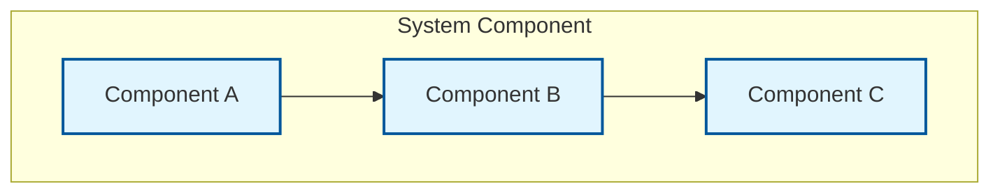

# DG-XXXX: [Guide Title]

---
id: DG-XXXX
title: [Guide Title]
audience: Framework Developers
status: Draft
owners: [Your Name or Team]
last_reviewed: YYYY-MM-DD
next_review: YYYY-MM-DD
related_reqs: [REQ-XXXX, REQ-YYYY]
related_scns: [SCN-XXX, SCN-YYY]
related_guides: [UG-XXXX, DG-YYYY]
diagram_required: true
---

## Overview

[Brief introduction to what this guide covers and who should read it.]

## Prerequisites

Before reading this guide, you should:

- [Prerequisite 1]
- [Prerequisite 2]
- Have read [related guides]

## Architecture

### Component Overview



### Module Structure

```elixir
# Module hierarchy
AshUI
├── Framework
│   ├── Element
│   ├── Screen
│   └── Binding
├── Compilation
├── Rendering
└── Runtime
```

## Implementation Details

### [Feature Name]

[Detailed explanation of how a feature is implemented.]

```elixir
# Implementation example
defmodule AshUI.Example do
  @moduledoc """
  Module documentation.
  """

  def example_function do
    # Implementation
  end
end
```

## Extension Points

### Custom [Component Name]

[How to extend or customize this component.]

## Testing

### Unit Tests

[How to write unit tests for this component.]

### Integration Tests

[How to write integration tests.]

## Performance Considerations

[Performance characteristics and optimization tips.]

## Debugging

### Common Issues

[How to debug issues in this area.]

## Contributing

[How to contribute to this part of the codebase.]

## See Also

- [Related User Guide](../user/UG-XXXX.md)
- [Related Specification](../../specs/contracts/some-contract.md)
- [Related ADR](../../specs/adr/ADR-XXXX.md)
