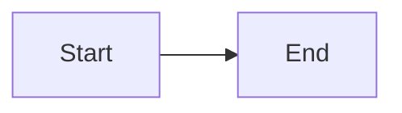

# UG-XXXX: [Guide Title]

---
id: UG-XXXX
title: [Guide Title]
audience: Application Developers
status: Draft
owners: [Your Name or Team]
last_reviewed: YYYY-MM-DD
next_review: YYYY-MM-DD
related_reqs: [REQ-XXXX, REQ-YYYY]
related_scns: [SCN-XXX, SCN-YYY]
related_guides: [UG-XXXX, DG-YYYY]
diagram_required: true
---

## Overview

[Brief introduction to what this guide covers and who should read it.]

## Prerequisites

Before reading this guide, you should:

- [Prerequisite 1]
- [Prerequisite 2]
- [Prerequisite 3]

## [Section 1]

### Subsection

[Content with explanations and examples.]

```elixir
# Code example
defmodule Example do
  # Your code here
end
```

### Diagram



## [Section 2]

[More content...]

## Common Patterns

### Pattern 1: [Name]

[Description of common pattern with example.]

### Pattern 2: [Name]

[Description of common pattern with example.]

## Troubleshooting

### Problem: [Description]

**Solution**: [How to fix it.]

### Problem: [Description]

**Solution**: [How to fix it.]

## See Also

- [Related Guide](../other-guide.md)
- [Related Specification](../../specs/contracts/some-contract.md)
- [External Documentation](https://example.com)
