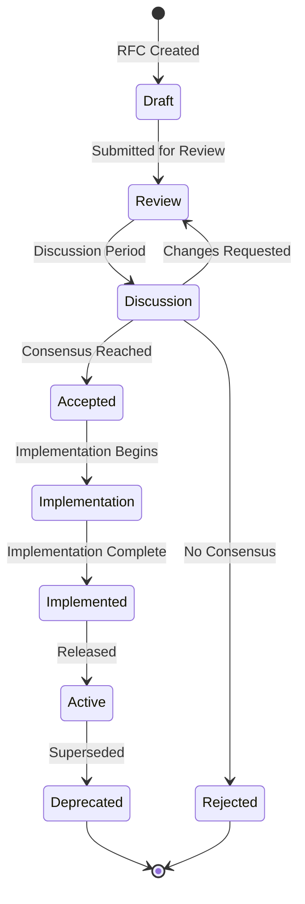

# Ash UI RFCs

This directory contains Requests for Comments (RFCs) for the Ash UI framework. RFCs are the primary mechanism for proposing and discussing significant changes to the framework.

## What is an RFC?

An RFC is a design document that describes:
- A proposed change to Ash UI
- The motivation for the change
- The technical approach
- The impact on existing code
- Alternatives considered

## RFC Lifecycle

## RFC States

| State | Description |
|---|---|
| **Draft** | Initial RFC being written by author |
| **Review** | RFC is open for community review |
| **Discussion** | Active discussion and refinement |
| **Accepted** | RFC approved for implementation |
| **Rejected** | RFC declined |
| **Implementation** | Changes are being implemented |
| **Implemented** | Implementation complete, not yet released |
| **Active** | Feature is released and in use |
| **Deprecated** | Feature superseded by new RFC |

## RFC Structure

Each RFC must include:

1. **Metadata** - ID, title, status, authors, dates
2. **Summary** - Brief description of the proposal
3. **Motivation** - Why this change is needed
4. **Proposed Design** - Detailed technical approach
5. **Governance Mapping** - Link to REQ-*, SCN-*, contracts
6. **Spec Creation Plan** - Specs that will be created
7. **Alternatives** - Other approaches considered
8. **Unresolved Questions** - Open questions

## Getting Started

See [getting-started.md](getting-started.md) for detailed instructions on creating and submitting RFCs.

## RFC Index

See [index.md](index.md) for a list of all RFCs and their current status.

## RFC Template

See [templates/rfc-template.md](templates/rfc-template.md) for the RFC template.

## Current RFCs

| RFC | Title | Status | Phase |
|---|---|---|---|
| RFC-0001 | Ash UI Governance System | Active | 1 |

## Related Documentation

- [../specs/](../specs/) - Technical specifications
- [../guides/](../guides/) - User and developer guides
