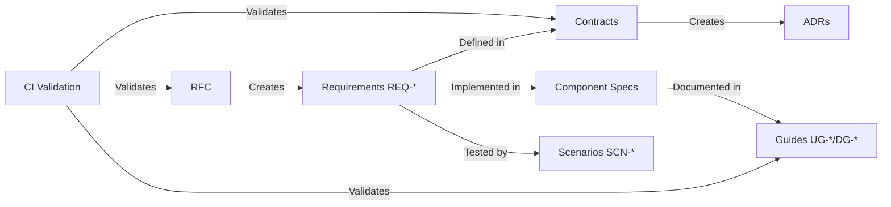

# RFC-0001: Ash UI Governance System

**Status**: Active
**Phase**: 1
**Authors**: Governance Team
**Created**: 2026-03-18
**Modified**: 2026-03-18

---

## Summary

This RFC establishes a comprehensive governance system for the Ash UI framework, implementing a traceability chain from RFCs → specifications (contracts/ADRs/components) → documentation (guides), with conformance testing and automated CI/CD enforcement.

## Motivation

### Problem Statement

The Ash UI framework lacks a formal governance structure for:
1. Tracking design decisions from proposal to implementation
2. Ensuring all requirements are tested and documented
3. Enforcing compliance through automated validation
4. Providing clear ownership boundaries across control planes

### Current Limitations

- No formal RFC process for proposing changes
- Requirements not linked to tests
- Documentation not tied to specifications
- No automated validation of governance rules
- Unclear ownership across system components

### Proposed Solution

Implement a governance system inspired by jido_os, adapted for Ash UI's resource-driven architecture:
1. RFC system for proposing changes
2. Specification contracts with normative requirements (REQ-*)
3. Architecture Decision Records (ADRs)
4. Conformance scenarios (SCN-*) for testing
5. Documentation guides with traceability
6. Automated validation scripts and CI workflows

## Proposed Design

### Overview



### Directory Structure

```
ash_ui/
├── specs/
│   ├── contracts/          # REQ-* requirements
│   ├── adr/               # ADR-XXXX decisions
│   ├── resources/         # Component specs
│   ├── compilation/       # Compiler specs
│   ├── rendering/         # Renderer specs
│   └── conformance/       # SCN-* scenarios
├── rfcs/                  # RFC-XXXX proposals
├── guides/                # UG-*/DG-* documentation
└── scripts/               # Validation scripts
```

### Control Plane Ownership

| Control Plane | Owner | Scope |
|---|---|---|
| Framework | AshUI.Framework | Resource definitions, type system |
| Compilation | AshUI.Compilation | Resource → IUR pipeline |
| Rendering | AshUI.Rendering | Output generation |
| Runtime | AshUI.Runtime | Session lifecycle |
| Extension | AshUI.Extension | Widget/plugin system |

### Requirement Families

| Family | Purpose | Example |
|---|---|---|
| REQ-RES-* | Resource definitions | REQ-RES-001: Resource Definition |
| REQ-SCREEN-* | Screen lifecycle | REQ-SCREEN-001: Screen Definition |
| REQ-BIND-* | Binding semantics | REQ-BIND-001: Binding Definition |
| REQ-COMP-* | Compilation | REQ-COMP-001: Compilation Pipeline |
| REQ-RENDER-* | Rendering | REQ-RENDER-001: Renderer Contract |
| REQ-AUTH-* | Authorization | REQ-AUTH-001: Policy Definition |
| REQ-OBS-* | Observability | REQ-OBS-001: Event Schema |

## Governance Mapping

### Requirements

| REQ ID | Description | Contract |
|---|---|---|
| REQ-GOV-001 | RFC process for changes | N/A |
| REQ-GOV-002 | Requirements traceability | N/A |
| REQ-GOV-003 | Conformance testing | N/A |
| REQ-GOV-004 | Automated validation | N/A |

### Scenarios

| SCN ID | Description | Status |
|---|---|---|
| SCN-GOV-001 | RFC submission workflow | Active |
| SCN-GOV-002 | Spec validation pass | Active |
| SCN-GOV-003 | Guide conformance check | Active |

### Contracts

- **New**: All files in `specs/contracts/`
- **New**: `specs/conformance/spec_conformance_matrix.md`

### ADRs

- **New**: `specs/adr/ADR-0001-control-plane-authority.md`

## Spec Creation Plan

| Spec | Type | Status | Priority |
|---|---|---|---|
| specs/topology.md | Architecture | Active | P0 |
| specs/contracts/*.md | Contract | Active | P0 |
| specs/adr/ADR-0001.md | Decision Record | Active | P0 |
| specs/conformance/scenario_catalog.md | Conformance | Active | P0 |
| rfcs/*.md | Process | Active | P0 |
| guides/contracts/*.md | Meta-documentation | Active | P0 |

## Alternatives

### Alternative 1: Minimal Governance (Rejected)

Only track RFCs without formal requirements traceability.

**Rejected Because**: No way to ensure all requirements are implemented and tested.

### Alternative 2: Heavyweight Process (Rejected)

Require formal reviews for every change, including documentation.

**Rejected Because**: Too much overhead for a framework in early development.

### Alternative 3: External Tooling (Rejected)

Use third-party governance tools instead of custom system.

**Rejected Because**: Adds dependency, doesn't integrate with our workflow.

## Unresolved Questions

1. Should we require formal review for all RFCs or only major changes?
2. How do we handle deprecated RFCs and specs?
3. What is the process for emergency changes?

## Implementation Plan

### Milestones

| Milestone | Description | Status |
|---|---|---|---|
| M1 | Directory structure and base files | Complete |
| M2 | RFC system documentation | Complete |
| M3 | Specification contracts | Complete |
| M4 | Conformance scenarios | Complete |
| M5 | Validation scripts | Pending |
| M6 | CI workflows | Pending |
| M7 | Initial content (RFC, specs, guides) | Pending |

### Tasks

- [x] Create directory structure
- [x] Write topology document
- [x] Create contract templates
- [x] Create ADR-0001
- [x] Create scenario catalog
- [x] Create RFC system
- [x] Create guide contracts
- [ ] Write validation scripts
- [ ] Set up CI workflows
- [ ] Create example RFC
- [ ] Create example component spec
- [ ] Create example guides

## References

- jido_os governance system (inspiration)
- Ash Framework documentation
- RFC 1: Internet Architecture Board
- ADRs: Michael Nygard's pattern

---

## Changelog

### 2026-03-18
- Initial RFC created
- Defined governance structure
- Established control plane ownership
