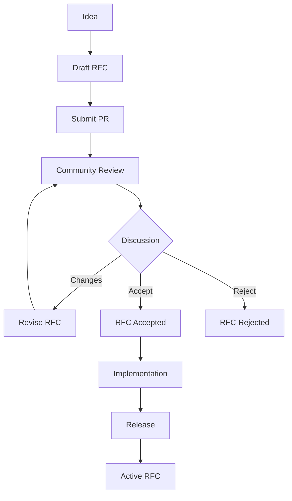

# Getting Started with Ash UI RFCs

This guide explains how to create, submit, and participate in the RFC process for Ash UI.

## Why Write an RFC?

You should write an RFC when you want to propose:

1. **New Features** - Significant new capabilities
2. **Breaking Changes** - Changes that affect existing APIs
3. **Architectural Changes** - Changes to system architecture
4. **Process Changes** - Changes to governance or workflows

You do **not** need an RFC for:

1. Bug fixes
2. Documentation improvements
3. Minor feature additions
4. Refactoring (no behavior change)
5. Performance improvements (no API change)

## RFC Process



## Step 1: Before Writing

### Check Existing RFCs

Search the [RFC index](index.md) to ensure your idea hasn't been discussed before.

### Discuss Informally

Before writing a full RFC:

1. Start a discussion in the appropriate channel
2. Gather initial feedback
3. Refine your idea

This saves time if the idea isn't viable.

### Determine the Scope

Consider:

- Is this large enough to warrant an RFC?
- Can this be broken into smaller RFCs?
- What phase does this belong to?

## Step 2: Write Your RFC

### Use the Template

Copy [templates/rfc-template.md](templates/rfc-template.md) and fill it out completely.

### Required Sections

| Section | Purpose |
|---|---|
| Metadata | Identification and tracking |
| Summary | Quick overview |
| Motivation | Why this is needed |
| Design | Technical details |
| Governance Mapping | Link to specs |
| Spec Creation Plan | What specs will be created |
| Alternatives | Other approaches |
| Unresolved Questions | Open issues |

### Tips for Good RFCs

1. **Be Specific** - Use concrete examples
2. **Show Code** - Include API examples
3. **Consider Edge Cases** - Think about failure modes
4. **Document Trade-offs** - Why this approach?
5. **Link Requirements** - Map to REQ-* entries

## Step 3: Submit Your RFC

### Create a Pull Request

1. Fork the repository
2. Create a branch: `rfc/YYYY-short-title`
3. Add your RFC file
4. Submit a PR with title `[RFC] Title of your RFC`

### PR Template

Your PR should include:

- **Title**: [RFC] Your RFC Title
- **Body**: Brief summary and link to RFC discussion

## Step 4: Participate in Review

### Discussion Period

RFCs have a minimum 2-week discussion period.

During review:

1. **Be Responsive** - Answer questions quickly
2. **Revise as Needed** - Update based on feedback
3. **Facilitate Consensus** - Help reach agreement
4. **Track Changes** - Mark revisions in the RFC

### Review Criteria

RFCs are evaluated on:

- **Motivation** - Is this problem worth solving?
- **Design** - Is the approach sound?
- **Completeness** - Are all concerns addressed?
- **Trade-offs** - Are consequences understood?
- **Governance** - Are REQ-* mappings complete?

## Step 5: Decision

### Acceptance

An RFC is accepted when:

1. Discussion period has elapsed
2. Consensus is reached (no substantive objections)
3. Governance team approves
4. Spec creation plan is complete

### Rejection

An RFC may be rejected if:

1. Consensus cannot be reached
2. The approach is deemed unsound
3. The problem is not a priority
4. An alternative is preferred

## Step 6: Implementation

### Before Implementing

Once accepted:

1. Create any required specifications
2. File implementation issues
3. Create a tracking project

### During Implementation

- Link commits to the RFC
- Update the RFC status
- Document deviations

### After Implementation

- Mark RFC as "Implemented"
- Create/revise related guides
- Announce the feature

## RFC Numbering

RFC numbers are assigned when the PR is submitted:

- RFC-0001 to RFC-0099: Phase 1 (Foundation)
- RFC-0100 to RFC-0199: Phase 2 (Core Features)
- RFC-0200 to RFC-0399: Phase 3 (Advanced Features)
- RFC-0400 to RFC-0599: Phase 4 (Optimization)
- RFC-0600+: Phase 5 (Future)

## Governance Mapping

Every RFC must map to:

1. **Requirements (REQ-*)** - What normative requirements are created/modified
2. **Scenarios (SCN-*)** - What acceptance criteria are added
3. **Contracts** - Which contracts are affected
4. **ADRs** - Whether a new ADR is needed

Example:

```markdown
## Governance Mapping

### Requirements
- REQ-COMP-011: Incremental Compilation
- REQ-COMP-012: Dependency Tracking

### Scenarios
- SCN-048: Incremental Compilation Success
- SCN-049: Dependency Change Detection

### Contracts
- New: compilation/incremental_contract.md
- Modified: compilation_contract.md

### ADRs
- New: ADR-0010: Incremental Compilation Strategy
```

## Questions?

- See [README.md](README.md) for RFC system overview
- See [index.md](index.md) for existing RFCs
- Open an issue for questions about the RFC process
