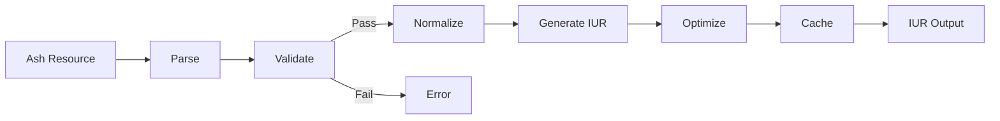

# Ash UI Compilation

This directory contains specifications for the Resource → IUR compilation pipeline.

## Compilation Overview

The compilation pipeline transforms Ash UI resources into the Intermediate UI Representation (IUR), which serves as the canonical format for rendering.

## Pipeline Stages



## Components

### Compiler (compilation/compiler.md)

Main compilation orchestrator.

**Responsibilities**:
- Pipeline orchestration
- Stage coordination
- Error handling

### Validator (compilation/validator.md)

Schema and constraint validation.

**Responsibilities**:
- Schema validation
- Constraint checking
- Error reporting

### IUR Generator (compilation/iur.md)

Intermediate UI Representation generation.

**Responsibilities**:
- IUR structure creation
- Reference resolution
- Serialization

### Normalizer (compilation/normalizer.md)

Representation standardization.

**Responsibilities**:
- Attribute ordering
- Default value application
- Redundancy elimination

### Optimizer (compilation/optimizer.md)

IUR optimization passes.

**Responsibilities**:
- Dead code elimination
- Constant folding
- Memoization

### Cache (compilation/cache.md)

Compilation result caching.

**Responsibilities**:
- Cache key generation
- Result storage
- Invalidation handling

## IUR Schema

```elixir
%AshUI.Compilation.IUR{
  id: UUID.t(),
  type: :screen | :element,
  name: String.t(),
  attributes: map(),
  children: [%AshUI.Compilation.IUR{}],
  bindings: [%AshUI.Compilation.BindingRef{}],
  metadata: map(),
  version: String.t()
}
```

## Related Specifications

- [compilation_contract.md](../contracts/compilation_contract.md)
- [resources/](../resources/) - Source resource definitions
- [rendering/](../rendering/) - Output rendering
