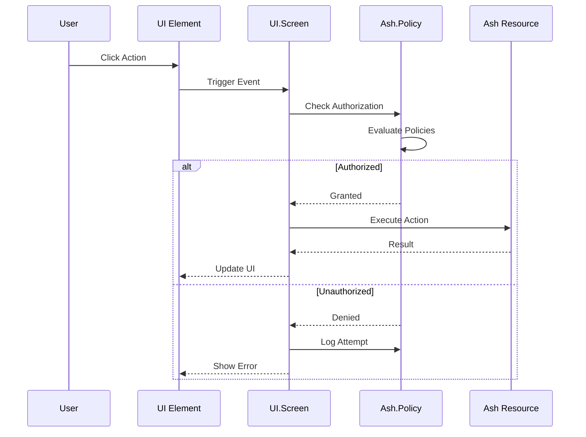
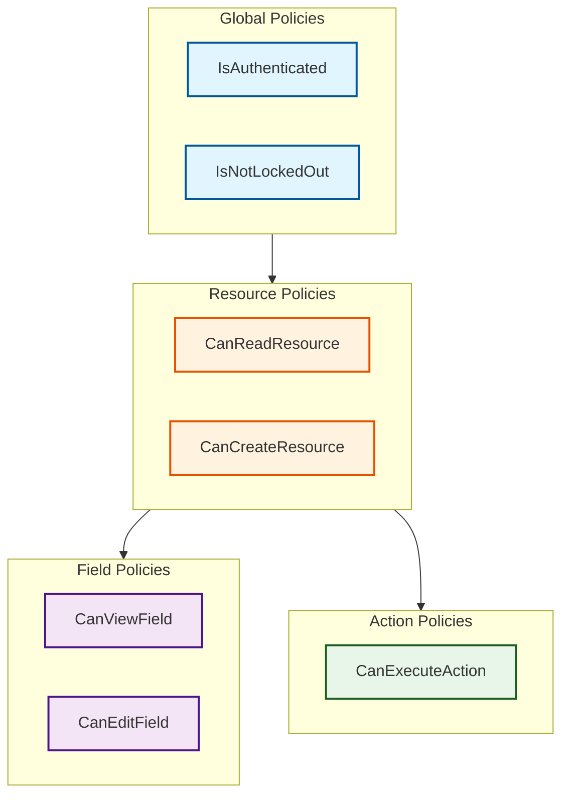

# Authorization Contract (REQ-AUTH-*)

This contract defines the normative requirements for authorization in the Ash UI framework.

## Purpose

Defines the requirements for integrating Ash Policy authorization with UI resources, ensuring secure access control for all UI operations.

## Control Plane

**Owner**: `AshUI.Framework` (Framework Control Plane)

**Enforcement**: `AshUI.Runtime` (Runtime Control Plane)

## Dependencies

- Ash.Policy.Authorizer
- REQ-RES-*: Resource definitions
- REQ-SCREEN-*: Screen lifecycle
- REQ-BIND-*: Binding semantics

## Requirements

### REQ-AUTH-001: Policy Definition

All UI resources MUST define Ash policies.

```elixir
defmodule AshUI.Resources.Element do
  use Ash.Resource

  policies do
    policy action(:read) do
      authorize_if AshUI.Policies.IsAuthenticated
    end

    policy action(:create) do
      authorize_if AshUI.Policies.IsAdmin
    end
  end
end
```

**Acceptance Criteria**:
- AC-001: Resources include `policies` DSL block
- AC-002: Policies exist for all actions
- AC-003: Policies have clear conditions
- AC-004: Policies are documented

### REQ-AUTH-002: Screen Authorization

Screens MUST enforce authorization at mount time.

**Authorization Points**:
- Screen mount - User can view the screen
- Element access - User can see specific elements
- Action execution - User can trigger actions
- Data access - User can access bound resources

**Acceptance Criteria**:
- AC-001: Mount checks occur before rendering
- AC-002: Unauthorized mounts redirect to login/error
- AC-003: Authorization failures are logged
- AC-004: Authorization context includes user and session

### REQ-AUTH-003: Action Authorization

All resource actions MUST check authorization before execution.

**Action Types**:
- Read actions - Data retrieval
- Create actions - Resource creation
- Update actions - Resource modification
- Destroy actions - Resource deletion
- Custom actions - Domain-specific operations

**Acceptance Criteria**:
- AC-001: Authorization is checked before action execution
- AC-002: Unauthorized actions return forbidden status
- AC-003: Action parameters don't bypass authorization
- AC-004: Bulk actions check authorization per item

### REQ-AUTH-004: Field-Level Authorization

Sensitive fields MUST support field-level authorization.

**Use Cases**:
- Hidden fields based on user role
- Read-only fields based on permissions
- Computed fields based on access level

**Acceptance Criteria**:
- AC-001: Fields can be marked as restricted
- AC-002: Field policies are evaluated independently
- AC-003: Unauthorized fields are filtered from output
- AC-004: Field authorization errors are distinct

### REQ-AUTH-005: Binding Authorization

Data bindings MUST respect authorization of bound resources.

**Binding Authorization**:
- Bindings only include authorized data
- Binding failures don't leak unauthorized info
- Filtered bindings don't reveal filter criteria

**Acceptance Criteria**:
- AC-001: Binding queries apply user filters
- AC-002: Unauthorized records are excluded
- AC-003: Binding errors don't leak data
- AC-004: Empty bindings are indistinguishable from no authorization

### REQ-AUTH-006: Resource Ownership

Resources MAY support ownership-based authorization.

**Ownership Models**:
- User-owned resources
- Team/organization-owned resources
- Hierarchical ownership

**Acceptance Criteria**:
- AC-001: Ownership attributes are defined
- AC-002: Ownership policies are enforced
- AC-003: Ownership transfer requires authorization
- AC-004: Orphaned resources are handled

### REQ-AUTH-007: Role-Based Access

Authorization SHOULD support role-based access control.

**Role Types**:
- `:admin` - Full access
- `:user` - Standard user access
- `:guest` - Limited/guest access
- Custom roles

**Acceptance Criteria**:
- AC-001: Roles are assigned to users
- AC-002: Roles grant specific permissions
- AC-003: Multiple roles can be combined
- AC-004: Role changes take effect immediately

### REQ-AUTH-008: Authorization Context

Authorization MUST be context-aware.

**Context Elements**:
- User identity
- Session ID
- Request IP
- Timestamp
- Screen/element being accessed

**Acceptance Criteria**:
- AC-001: Context is passed to policy checks
- AC-002: Context includes all relevant factors
- AC-003: Context changes trigger re-authorization
- AC-004: Context is tamper-evident

### REQ-AUTH-009: Error Handling

Authorization failures MUST produce clear, secure error messages.

**Error Behavior**:
- Generic messages for unauthorized access
- Specific messages for authorized users
- No leakage of authorization criteria

**Acceptance Criteria**:
- AC-001: Error messages don't reveal sensitive info
- AC-002: Errors are logged with full context
- AC-003: Error types distinguish authorization from other failures
- AC-004: Rate limiting applies to authorization failures

### REQ-AUTH-010: Authorization Caching

Authorization decisions MAY be cached for performance.

**Cache Keys**:
- User ID
- Resource/action
- Policy version
- Context hash

**Acceptance Criteria**:
- AC-001: Cache is scoped to user
- AC-002: Cache invalidates on permission changes
- AC-003: Cache TTL is configurable
- AC-004: Cache misses don't degrade security

### REQ-AUTH-011: Audit Logging

Authorization events MUST be logged for audit purposes.

**Logged Events**:
- Authorization checks (pass/fail)
- Policy changes
- Role changes
- Access denied events

**Acceptance Criteria**:
- AC-001: Logs include user, resource, action, result
- AC-002: Logs are tamper-evident
- AC-003: Logs are retained per retention policy
- AC-004: Sensitive data is not logged

### REQ-AUTH-012: Observability

Authorization MUST emit telemetry events.

**Event Types**:
- Authorization check
- Authorization success/failure
- Policy evaluation time
- Cache hit/miss

**Acceptance Criteria**:
- AC-001: Events include authorization context
- AC-002: Events don't include sensitive data
- AC-003: Events follow standard telemetry schema
- AC-004: Metrics include success/failure rates

## Authorization Flow



## Policy Hierarchy



## Traceability

| Requirement | ADR | Component Spec | Scenarios |
|---|---|---|---|
| REQ-AUTH-001 | ADR-0003 | framework/policies.md | SCN-501, SCN-502 |
| REQ-AUTH-002 | ADR-0003 | runtime/session.md | SCN-503, SCN-504 |
| REQ-AUTH-003 | ADR-0003 | framework/actions.md | SCN-505, SCN-506 |
| REQ-AUTH-004 | ADR-0017 | framework/field_policies.md | SCN-507, SCN-508 |
| REQ-AUTH-005 | - | runtime/binding.md | SCN-509 |
| REQ-AUTH-006 | - | framework/ownership.md | SCN-510, SCN-511 |
| REQ-AUTH-007 | ADR-0018 | framework/roles.md | SCN-512, SCN-513 |
| REQ-AUTH-008 | - | runtime/context.md | SCN-514 |
| REQ-AUTH-009 | - | runtime/errors.md | SCN-515 |
| REQ-AUTH-010 | ADR-0019 | framework/auth_cache.md | SCN-516 |
| REQ-AUTH-011 | ADR-0020 | framework/audit.md | SCN-517 |
| REQ-AUTH-012 | - | observability_contract.md | SCN-518 |

## Conformance

See [conformance/spec_conformance_matrix.md](../conformance/spec_conformance_matrix.md) for complete scenario mappings.

## Related Specifications

- [topology.md](../topology.md)
- [resource_contract.md](resource_contract.md)
- [screen_contract.md](screen_contract.md)
- [binding_contract.md](binding_contract.md)
