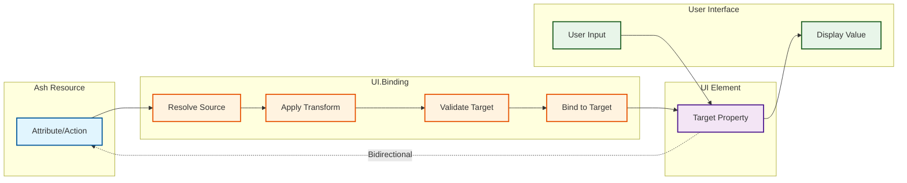
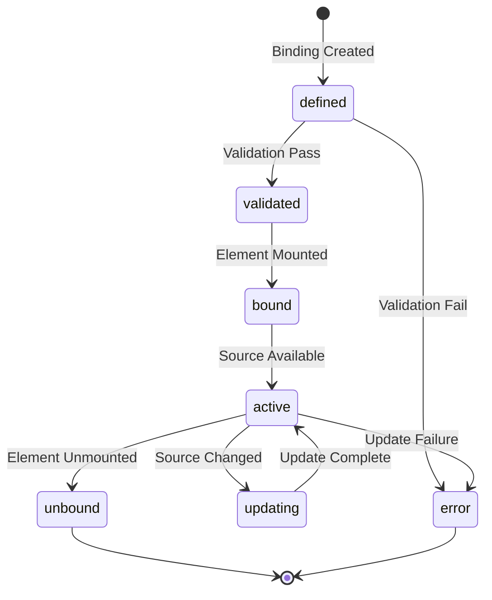

# Binding Contract (REQ-BIND-*)

This contract defines the normative requirements for UI.Binding semantics in the Ash UI framework.

## Purpose

Defines the requirements for data bindings that connect UI elements to Ash resources, enabling reactive UI updates and event handling.

## Control Plane

**Owner**: `AshUI.Framework` (Framework Control Plane)

## Dependencies

- REQ-RES-*: Resource definitions
- REQ-SCREEN-*: Screen context
- REQ-COMP-*: Compilation contracts

## Requirements

### REQ-BIND-001: Binding Definition

All bindings MUST be defined as UI.Binding resources.

```elixir
defmodule AshUI.Bindings.UserProfile do
  use Ash.Resource,
    domain: AshUI.Domain,
    data_layer: AshPostgres.DataLayer

  attributes do
    uuid_primary_key :id
    attribute :source, :string
    attribute :target, :string
    attribute :binding_type, :atom, constraints: [one_of: [:value, :list, :action]]
    attribute :transform, :map, default: %{}
  end

  relationships do
    belongs_to :element, AshUI.Resources.Element
    belongs_to :screen, AshUI.Resources.Screen
  end
end
```

**Acceptance Criteria**:
- AC-001: Bindings use `use Ash.Resource`
- AC-002: Bindings specify source and target paths
- AC-003: Bindings specify binding type
- AC-004: Bindings are associated with elements and screens

### REQ-BIND-002: Binding Types

Bindings MUST support three fundamental types.

**Binding Types**:

1. **`:value`** - Single value binding
   - Binds an element property to a single resource attribute
   - Updates propagate bidirectionally

2. **`:list`** - Collection binding
   - Binds an element to a collection of resources
   - Updates propagate from resource to element only

3. **`:action`** - Action binding
   - Binds an element event to a resource action
   - Triggers the action when the element event fires

**Acceptance Criteria**:
- AC-001: Bindings declare a valid binding_type
- AC-002: Unknown binding types are rejected
- AC-003: Binding type semantics are enforced

### REQ-BIND-003: Source Resolution

Bindings MUST resolve source paths to Ash resources.

**Source Path Format**: `<Domain>.<Resource>.<Attribute|Action>`

**Examples**:
- `MyApp.Accounts.User.name` - Attribute binding
- `MyApp.Accounts.User.toggle_active` - Action binding
- `MyApp.Accounts.Post.[author.comments]` - Nested collection

**Acceptance Criteria**:
- AC-001: Sources are validated at compilation time
- AC-002: Invalid sources produce compilation errors
- AC-003: Nested paths are fully resolved
- AC-004: Circular dependencies are detected

### REQ-BIND-004: Target Binding

Bindings MUST bind to valid element target properties.

**Target Property Format**: `element.<property>`

**Common Target Properties**:
- `element.value` - Display value
- `element.placeholder` - Placeholder text
- `element.disabled` - Disabled state
- `element.onClick` - Click handler

**Acceptance Criteria**:
- AC-001: Targets are validated against element schemas
- AC-002: Invalid targets produce compilation errors
- AC-003: Target types match source types (or are coercible)
- AC-004: Multiple bindings to the same target are merged

### REQ-BIND-005: Transformation

Bindings MAY include transformation rules.

**Transformation Types**:
- `format` - String formatting (e.g., date formatting)
- `compute` - Computed values (e.g., full name from first/last)
- `validate` - Validation rules (e.g., min/max length)
- `default` - Default values when source is nil

**Acceptance Criteria**:
- AC-001: Transformations are declared in the `transform` map
- AC-002: Transformations are applied in order
- AC-003: Transformations don't violate type constraints
- AC-004: Transformation errors are surfaced

### REQ-BIND-006: Reactivity

Bindings MUST trigger reactive updates when source data changes.

**Acceptance Criteria**:
- AC-001: Source changes trigger binding re-evaluation
- AC-002: Re-evaluation updates element state
- AC-003: Update propagation is batched for performance
- AC-004: Stale bindings don't prevent new updates

### REQ-BIND-007: Bidirectional Updates

`:value` bindings MUST support bidirectional updates.

**Acceptance Criteria**:
- AC-001: Element changes update source resources
- AC-002: Source changes update element state
- AC-003: Update cycles are prevented
- AC-004: Conflict resolution is defined

### REQ-BIND-008: Action Execution

`:action` bindings MUST execute resource actions when triggered.

**Acceptance Criteria**:
- AC-001: Action bindings receive element event data
- AC-002: Actions are executed with proper authorization
- AC-003: Action results trigger UI updates
- AC-004: Action errors are surfaced to the user

### REQ-BIND-009: Validation

Bindings MUST validate both configuration and runtime values.

**Acceptance Criteria**:
- AC-001: Required binding attributes are validated
- AC-002: Source and target paths are valid
- AC-003: Transformation rules are valid
- AC-004: Runtime validation errors are user-friendly

### REQ-BIND-010: Observability

Bindings MUST emit telemetry events for binding operations.

**Acceptance Criteria**:
- AC-001: Binding evaluation events include source and target
- AC-002: Update events include old and new values
- AC-003: Error events include binding context
- AC-004: Events follow the standard telemetry schema

## Binding Data Flow



## Binding Lifecycle



## Traceability

| Requirement | ADR | Component Spec | Scenarios |
|---|---|---|---|
| REQ-BIND-001 | ADR-0001 | resources/ui_binding.md | SCN-201, SCN-202 |
| REQ-BIND-002 | - | resources/ui_binding.md | SCN-203, SCN-204 |
| REQ-BIND-003 | ADR-0003 | compilation/resolver.md | SCN-205, SCN-206 |
| REQ-BIND-004 | - | compilation/validator.md | SCN-207 |
| REQ-BIND-005 | ADR-0004 | compilation/transform.md | SCN-208, SCN-209 |
| REQ-BIND-006 | ADR-0005 | runtime/reactive.md | SCN-210, SCN-211 |
| REQ-BIND-007 | ADR-0005 | runtime/reactive.md | SCN-212 |
| REQ-BIND-008 | ADR-0006 | runtime/actions.md | SCN-213, SCN-214 |
| REQ-BIND-009 | - | compilation/validator.md | SCN-215 |
| REQ-BIND-010 | - | observability_contract.md | SCN-216 |

## Conformance

See [conformance/spec_conformance_matrix.md](../conformance/spec_conformance_matrix.md) for complete scenario mappings.

## Related Specifications

- [topology.md](../topology.md)
- [resource_contract.md](resource_contract.md)
- [screen_contract.md](screen_contract.md)
- [compilation_contract.md](compilation_contract.md)
