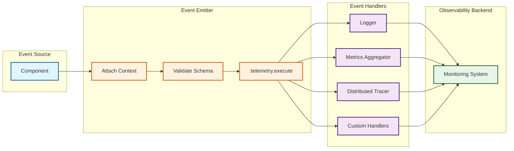
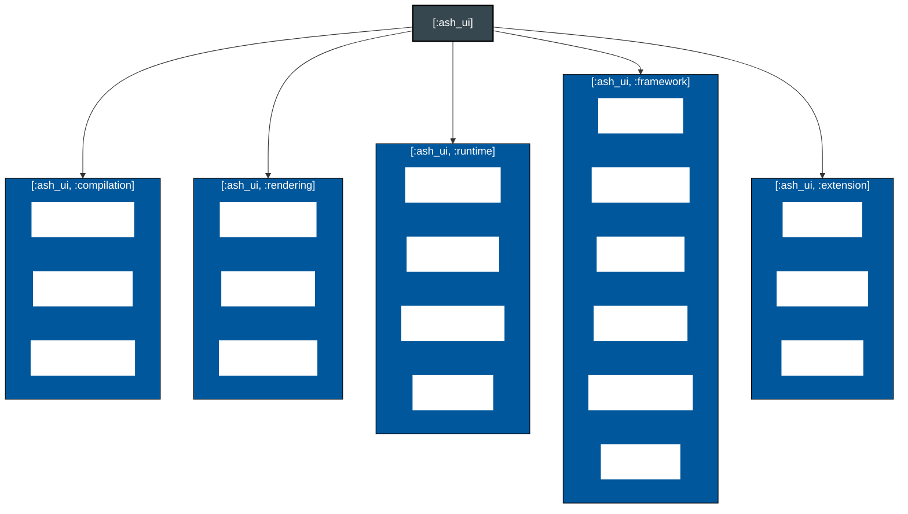

# Observability Contract (REQ-OBS-*)

This contract defines the normative requirements for telemetry, events, and observability in the Ash UI framework.

## Purpose

Defines the requirements for collecting, emitting, and processing telemetry data across all control planes, enabling operational visibility and debugging.

## Control Plane

**Owner**: `AshUI.Framework` (Framework Control Plane)

**Coordination**: All control planes contribute events

## Dependencies

- :telemetry library
- REQ-FRAMEWORK-*: Framework contracts

## Requirements

### REQ-OBS-001: Event Schema

All telemetry events MUST follow the standard event schema.

**Event Structure**:
```elixir
%{
  event_name: [:ash_ui, :control_plane, :event_type],
  measurements: %{
    duration: native_time(),
    count: integer()
  },
  metadata: %{
    resource_id: UUID.t(),
    resource_type: atom(),
    session_id: UUID.t() | nil,
    user_id: UUID.t() | nil,
    status: :ok | :error | :timeout,
    error: term() | nil
  }
}
```

**Acceptance Criteria**:
- AC-001: Events have qualified names ([:ash_ui, ...])
- AC-002: Events include measurements (numeric values)
- AC-003: Events include structured metadata
- AC-004: Events are documented

### REQ-OBS-002: Event Categories

All control planes MUST emit events for their operations.

**Event Categories**:

| Category | Events | Control Plane |
|---|---|---|
| **compilation** | compile_start, compile_end, compile_error | Compilation |
| **rendering** | render_start, render_end, render_error | Rendering |
| **runtime** | mount_start, mount_end, event_handle, unmount | Runtime |
| **binding** | bind_eval, bind_update, bind_error | Framework |
| **authorization** | auth_check, auth_success, auth_fail | Framework |
| **extension** | ext_load, ext_unload, ext_error | Extension |

**Acceptance Criteria**:
- AC-001: Each control plane emits its category events
- AC-002: Events are emitted at appropriate times
- AC-003: Event pairs (start/end) use consistent IDs
- AC-004: Error events include error details

### REQ-OBS-003: Span Context

Events MUST include span context for distributed tracing.

**Span Fields**:
- `span_id` - Unique identifier for this span
- `parent_span_id` - Parent span identifier
- `trace_id` - Correlation identifier for the trace

**Acceptance Criteria**:
- AC-001: Spans are created for request lifecycles
- AC-002: Parent/child relationships are maintained
- AC-003: Trace IDs propagate across processes
- AC-004: Span context is optional (for compatibility)

### REQ-OBS-004: Metrics

Events MUST include measurable metrics.

**Metric Types**:
- **Duration** - Time-based measurements (native time units)
- **Count** - Integer counts of occurrences
- **Size** - Byte sizes or element counts
- **Gauge** - Point-in-time values

**Acceptance Criteria**:
- AC-001: Duration is measured for all operations
- AC-002: Counts are used for discrete events
- AC-003: Units are specified
- AC-004: Metrics are aggregation-friendly

### REQ-OBS-005: Logging

Structured logging MUST complement telemetry events.

**Log Levels**:
- `:debug` - Detailed diagnostic information
- `:info` - General informational messages
- `:warn` - Warning messages
- `:error` - Error messages

**Acceptance Criteria**:
- AC-001: Logger is used for human-readable messages
- AC-002: Log levels are configurable
- AC-003: Sensitive data is redacted
- AC-004: Logs include correlation IDs

### REQ-OBS-006: Error Tracking

Errors MUST be tracked with full context.

**Error Events**:
- Error type and message
- Stack trace (in development)
- Resource/action that failed
- User and session context

**Acceptance Criteria**:
- AC-001: All errors emit telemetry events
- AC-002: Error context is complete
- AC-003: Stack traces are truncated in production
- AC-004: Error correlation is maintained

### REQ-OBS-007: Performance Monitoring

Performance MUST be measurable through telemetry.

**Performance Metrics**:
- Request/response latency
- Query execution time
- Compilation duration
- Rendering time
- Memory usage

**Acceptance Criteria**:
- AC-001: Duration is measured for all operations
- AC-002: Percentiles can be calculated
- AC-003: Memory metrics are available
- AC-004: Performance baselines are established

### REQ-OBS-008: Session Observability

LiveView sessions MUST emit lifecycle events.

**Session Events**:
- Session created
- Session mounted (screen)
- Session updated (event)
- Session closed
- Session crashed

**Acceptance Criteria**:
- AC-001: Sessions have unique identifiers
- AC-002: Session lifecycle is fully traced
- AC-003: Session events include screen info
- AC-004: Session errors are tracked

### REQ-OBS-009: Custom Events

Components MAY emit custom telemetry events.

**Custom Event Guidelines**:
- Use `[:ash_ui, :custom, ...]` prefix
- Document event schema
- Follow standard patterns
- Mark as experimental if needed

**Acceptance Criteria**:
- AC-001: Custom events are namespaced
- AC-002: Custom events are documented
- AC-003: Custom events follow standard patterns
- AC-004: Custom events can be disabled

### REQ-OBS-010: Event Handlers

Applications MUST be able to attach event handlers.

**Handler Use Cases**:
- Metrics aggregation
- Logging to external services
- Real-time monitoring
- Alerting

**Acceptance Criteria**:
- AC-001: Handlers can be attached at runtime
- AC-002: Handlers receive all event data
- AC-003: Handlers don't block execution
- AC-004: Handler errors don't crash the system

### REQ-OBS-011: Sampling

Telemetry MAY use sampling for high-volume events.

**Sampling Strategies**:
- No sampling (all events)
- Fixed-rate sampling
- Dynamic sampling based on load
- Head-based sampling (always sample certain traces)

**Acceptance Criteria**:
- AC-001: Sampling is configurable
- AC-002: Sampling decisions are deterministic
- AC-003: Errors are never sampled out
- AC-004: Sampling rate is exposed

### REQ-OBS-012: Data Privacy

Observability MUST respect data privacy requirements.

**Privacy Rules**:
- No PII in event names
- Redact sensitive metadata
- Respect user consent
- Provide data deletion

**Acceptance Criteria**:
- AC-001: Sensitive data is redacted by default
- AC-002: PII is excluded from events
- AC-003: User consent is respected
- AC-004: Data retention policies are enforced

## Event Flow



## Event Taxonomy



## Traceability

| Requirement | ADR | Component Spec | Scenarios |
|---|---|---|---|
| REQ-OBS-001 | ADR-0021 | observability/schema.md | SCN-601, SCN-602 |
| REQ-OBS-002 | - | observability/events.md | SCN-603 |
| REQ-OBS-003 | ADR-0022 | observability/tracing.md | SCN-604, SCN-605 |
| REQ-OBS-004 | - | observability/metrics.md | SCN-606 |
| REQ-OBS-005 | - | observability/logging.md | SCN-607 |
| REQ-OBS-006 | - | observability/errors.md | SCN-608 |
| REQ-OBS-007 | ADR-0023 | observability/performance.md | SCN-609, SCN-610 |
| REQ-OBS-008 | - | runtime/session.md | SCN-611, SCN-612 |
| REQ-OBS-009 | - | observability/custom.md | SCN-613 |
| REQ-OBS-010 | - | observability/handlers.md | SCN-614 |
| REQ-OBS-011 | ADR-0024 | observability/sampling.md | SCN-615 |
| REQ-OBS-012 | ADR-0025 | observability/privacy.md | SCN-616 |

## Conformance

See [conformance/spec_conformance_matrix.md](../conformance/spec_conformance_matrix.md) for complete scenario mappings.

## Related Specifications

- [topology.md](../topology.md)
- All control plane contracts
