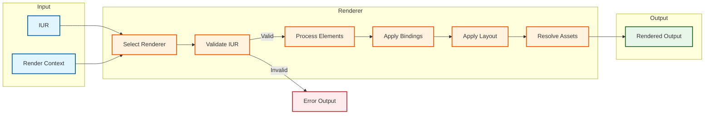
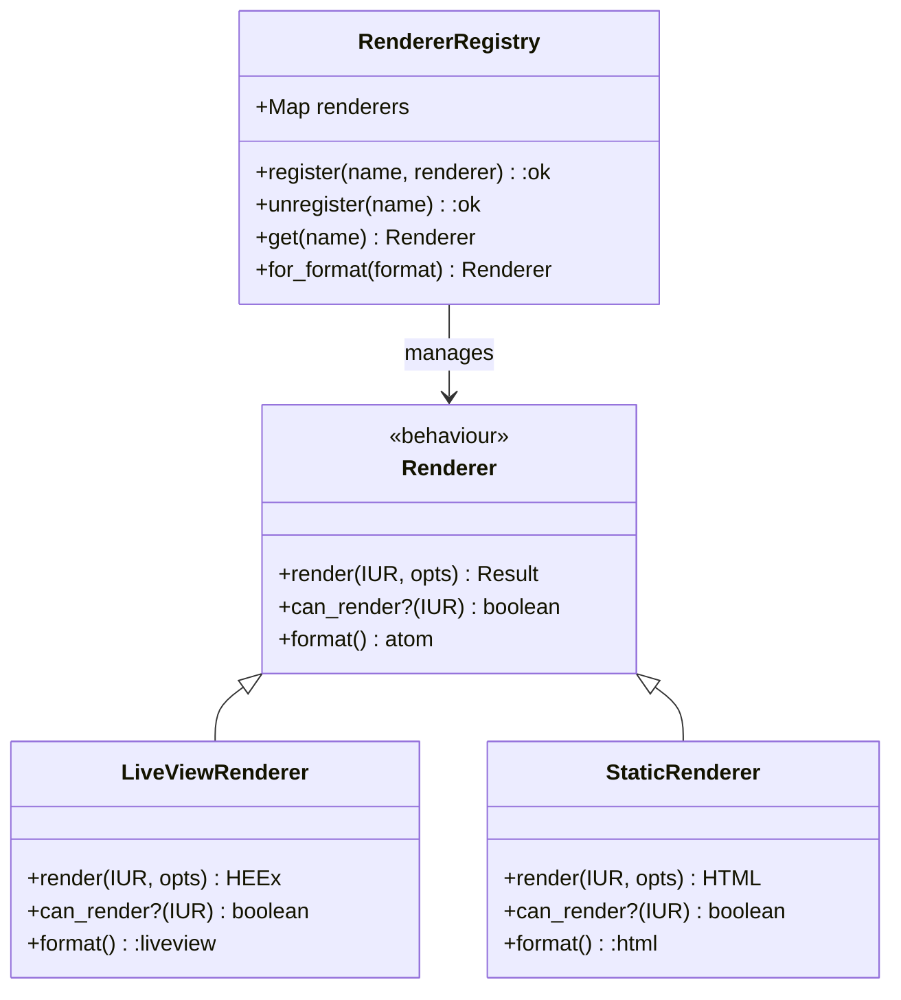

# Rendering Contract (REQ-RENDER-*)

This contract defines the normative requirements for IUR → Output rendering in the Ash UI framework.

## Purpose

Defines the requirements for rendering Intermediate UI Representation (IUR) to target output formats (LiveView HEEx, static HTML, etc.).

## Control Plane

**Owner**: `AshUI.Rendering` (Rendering Control Plane)

## Dependencies

- REQ-COMP-*: IUR definitions
- REQ-FRAMEWORK-*: Framework contracts

## Requirements

### REQ-RENDER-001: Renderer Contract

All renderers MUST implement the standard renderer contract.

**Renderer Behaviour**:
```elixir
defbehaviour AshUI.Renderer do
  @callback render(IUR.t(), keyword()) :: {:ok, RendererOutput.t()} | {:error, term()}
  @callback can_render?(IUR.t()) :: boolean()
  @callback format() :atom()
end
```

**Acceptance Criteria**:
- AC-001: All renderers implement the behaviour
- AC-002: Renderers declare their supported format
- AC-003: Renderers validate input before rendering
- AC-004: Renderers return structured output

### REQ-RENDER-002: LiveView Rendering

The LiveView renderer MUST produce valid HEEx templates.

**Output Format**: HEEx (Phoenix LiveView Engine)

**Requirements**:
- Valid HEEx syntax
- LiveView event bindings
- Reactive update support
- Safe HTML escaping

**Acceptance Criteria**:
- AC-001: Output is valid HEEx
- AC-002: Events are bound to LiveView handlers
- AC-003: Dynamic values use assigns
- AC-004: HTML is properly escaped

### REQ-RENDER-003: Static HTML Rendering

The static renderer MUST produce standalone HTML documents.

**Output Format**: HTML5

**Requirements**:
- Complete HTML document structure
- Inline CSS/JS (or external links)
- No dynamic dependencies
- SEO-friendly markup

**Acceptance Criteria**:
- AC-001: Output is valid HTML5
- AC-002: Document includes DOCTYPE
- AC-003: No unescaped interpolation
- AC-004: Meta tags are present

### REQ-RENDER-004: Component Rendering

Renderers MUST support rendering individual UI components.

**Acceptance Criteria**:
- AC-001: Elements can be rendered independently
- AC-002: Partial rendering updates are supported
- AC-003: Component state is preserved
- AC-004: Component boundaries are respected

### REQ-RENDER-005: Data Binding Rendering

Renderers MUST preserve data binding semantics.

**Acceptance Criteria**:
- AC-001: Bindings are translated to output format equivalents
- AC-002: Reactive bindings use LiveView bindings
- AC-003: Static bindings render current values
- AC-004: Action bindings create event handlers

### REQ-RENDER-006: Error Handling

Renderers MUST handle rendering errors gracefully.

**Acceptance Criteria**:
- AC-001: Invalid IUR produces error output
- AC-002: Error output includes error details
- AC-003: Errors don't crash the renderer
- AC-004: Error rendering can be configured

### REQ-RENDER-007: Layout Support

Renderers MUST support screen layouts.

**Layout Types**:
- `:default` - Standard full-page layout
- `:bare` - No layout (component only)
- `:modal` - Modal dialog layout
- `:panel` - Side panel layout

**Acceptance Criteria**:
- AC-001: Layouts wrap screen content
- AC-002: Layouts can be customized
- AC-003: Nested layouts are supported
- AC-004: Layout errors are surfaced

### REQ-RENDER-008: Asset Management

Renderers MUST handle asset references correctly.

**Asset Types**:
- CSS stylesheets
- JavaScript modules
- Images
- Fonts

**Acceptance Criteria**:
- AC-001: Asset paths are resolved
- AC-002: Asset digests are used (in production)
- AC-003: Missing assets produce warnings
- AC-004: Asset loading is configurable

### REQ-RENDER-009: Accessibility

Renderers MUST produce accessible markup.

**Accessibility Features**:
- ARIA attributes
- Semantic HTML elements
- Keyboard navigation
- Screen reader support

**Acceptance Criteria**:
- AC-001: Interactive elements have focus indicators
- AC-002: Forms have proper labels
- AC-003: ARIA attributes are present where needed
- AC-004: Semantic HTML is preferred

### REQ-RENDER-010: Performance

Renderers MUST meet performance requirements.

**Performance Targets**:
- Initial render: < 100ms for simple screens
- Update render: < 50ms for small changes
- Memory: Linear growth with IUR size

**Acceptance Criteria**:
- AC-001: Rendering completes within time limits
- AC-002: Memory usage is bounded
- AC-003: Large screens use progressive rendering
- AC-004: Performance can be measured

### REQ-RENDER-011: Extensibility

Renderers MUST support custom component rendering.

**Extension Points**:
- Custom element types
- Custom layouts
- Render hooks
- Middleware

**Acceptance Criteria**:
- AC-001: Custom components can be registered
- AC-002: Custom components override defaults
- AC-003: Render hooks can modify output
- AC-004: Extensions are isolated

### REQ-RENDER-012: Observability

Renderers MUST emit telemetry events.

**Event Types**:
- Render started
- Render completed
- Render error
- Cache hit/miss

**Acceptance Criteria**:
- AC-001: Events include IUR ID
- AC-002: Events include renderer type
- AC-003: Events include duration
- AC-004: Events follow standard telemetry schema

## Rendering Pipeline



## Renderer Registry



## Traceability

| Requirement | ADR | Component Spec | Scenarios |
|---|---|---|---|
| REQ-RENDER-001 | ADR-0011 | rendering/registry.md | SCN-401, SCN-402 |
| REQ-RENDER-002 | ADR-0012 | rendering/liveview.md | SCN-403, SCN-404 |
| REQ-RENDER-003 | ADR-0013 | rendering/static.md | SCN-405, SCN-406 |
| REQ-RENDER-004 | - | rendering/component.md | SCN-407 |
| REQ-RENDER-005 | - | rendering/binding.md | SCN-408, SCN-409 |
| REQ-RENDER-006 | - | rendering/errors.md | SCN-410 |
| REQ-RENDER-007 | - | rendering/layout.md | SCN-411, SCN-412 |
| REQ-RENDER-008 | - | rendering/assets.md | SCN-413 |
| REQ-RENDER-009 | ADR-0014 | rendering/a11y.md | SCN-414, SCN-415 |
| REQ-RENDER-010 | ADR-0015 | rendering/performance.md | SCN-416 |
| REQ-RENDER-011 | ADR-0016 | rendering/extensibility.md | SCN-417, SCN-418 |
| REQ-RENDER-012 | - | observability_contract.md | SCN-419 |

## Conformance

See [conformance/spec_conformance_matrix.md](../conformance/spec_conformance_matrix.md) for complete scenario mappings.

## Related Specifications

- [topology.md](../topology.md)
- [compilation_contract.md](compilation_contract.md)
- [screen_contract.md](screen_contract.md)
