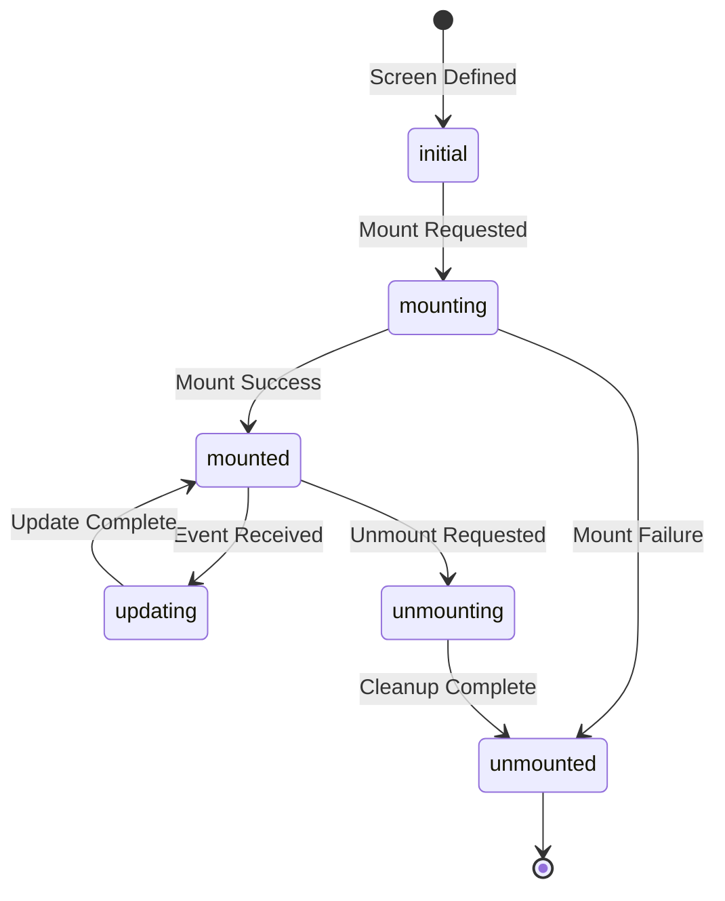
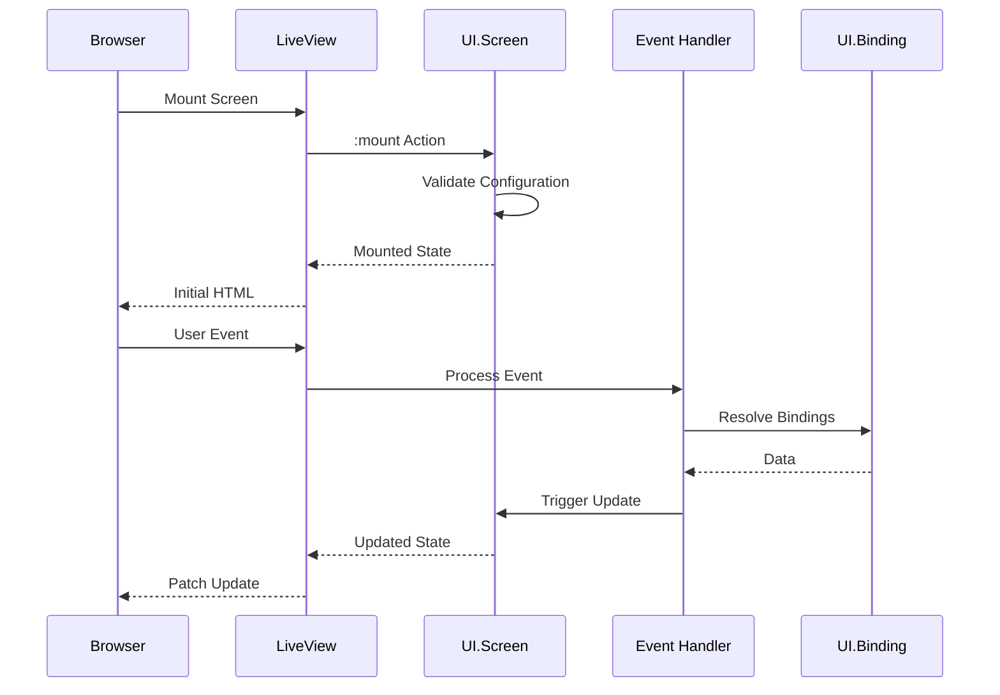

# Screen Contract (REQ-SCREEN-*)

This contract defines the normative requirements for UI.Screen lifecycle and behavior in the Ash UI framework.

## Purpose

Defines the requirements for UI.Screen resources, which represent composable page or view containers in the Ash UI system. Screens manage the lifecycle of child elements and provide the boundary for LiveView sessions.

## Control Plane

**Owner**: `AshUI.Runtime` (Runtime Control Plane)

## Dependencies

- REQ-RES-*: Resource definitions
- REQ-COMP-*: Compilation contracts
- REQ-RUNTIME-*: Runtime session management

## Requirements

### REQ-SCREEN-001: Screen Definition

All screens MUST be defined as Ash Resources with the `AshUI.Screen` DSL extension.

```elixir
defmodule AshUI.Screens.Dashboard do
  use Ash.Resource,
    domain: AshUI.Domain,
    data_layer: AshPostgres.DataLayer

  ui_screen do
    layout :dashboard
    route "/dashboard"
  end

  actions do
    defaults [:read, :create, :update, :destroy]

    action :mount do
      argument :user_id, :uuid
      run {AshUI.Screen.Actions, :mount_screen}
    end
  end
end
```

**Acceptance Criteria**:
- AC-001: Screens use `use Ash.Resource`
- AC-002: Screens include `ui_screen` DSL block
- AC-003: Screens define a layout type

### REQ-SCREEN-002: Lifecycle Management

Screens MUST implement standard lifecycle actions.

**Rationale**: Lifecycle hooks ensure proper initialization and cleanup of screen state.

**Lifecycle States**:
1. `:initial` - Screen definition loaded
2. `:mounting` - Screen is being mounted
3. `:mounted` - Screen is active and ready
4. `:updating` - Screen is processing updates
5. `:unmounting` - Screen is being cleaned up
6. `:unmounted` - Screen is terminated

**Acceptance Criteria**:
- AC-001: Screens implement `:mount` action
- AC-002: Screens implement `:unmount` action
- AC-003: State transitions follow the defined state machine
- AC-004: Invalid transitions are prevented

### REQ-SCREEN-003: Element Composition

Screens MUST support composition of child elements.

**Acceptance Criteria**:
- AC-001: Screens have `has_many :elements` relationship
- AC-002: Elements maintain position/order within screens
- AC-003: Screen deletion cascades to elements
- AC-004: Elements can be added/removed from screens

### REQ-SCREEN-004: Data Binding

Screens MUST provide data binding context for child elements.

**Acceptance Criteria**:
- AC-001: Screens define data sources for bindings
- AC-002: Binding resolution is scoped to screen context
- AC-003: Changes to bindings trigger screen re-renders
- AC-004: Binding errors are surfaced to the screen level

### REQ-SCREEN-005: Routing

Screens MUST be routable from the Phoenix endpoint.

**Acceptance Criteria**:
- AC-001: Screens define a route path
- AC-002: Routes are unique across all screens
- AC-003: Route parameters are passed to mount action
- AC-004: Invalid routes return 404

### REQ-SCREEN-006: Session Isolation

Screens MUST maintain isolated state per LiveView session.

**Acceptance Criteria**:
- AC-001: Each session has independent screen state
- AC-002: Session state changes don't affect other sessions
- AC-003: Session termination cleans up screen state
- AC-004: Concurrent sessions are supported

### REQ-SCREEN-007: Event Handling

Screens MUST handle and route user events to appropriate handlers.

**Acceptance Criteria**:
- AC-001: Screens define event handlers
- AC-002: Events are validated before processing
- AC-003: Event errors don't crash the LiveView session
- AC-004: Event responses trigger re-renders

### REQ-SCREEN-008: Authorization

Screens MUST enforce authorization at mount time and for each action.

**Acceptance Criteria**:
- AC-001: Mount action checks user authorization
- AC-002: Unauthorized mount attempts redirect to login
- AC-003: Action authorization is checked before execution
- AC-004: Policy failures return user-friendly errors

### REQ-SCREEN-009: Validation

Screens MUST validate configuration before mounting.

**Acceptance Criteria**:
- AC-001: Invalid screen definitions fail fast
- AC-002: Validation errors are descriptive
- AC-003: Required elements are present
- AC-004: Circular dependencies are detected

### REQ-SCREEN-010: Observability

Screens MUST emit telemetry events for lifecycle transitions.

**Acceptance Criteria**:
- AC-001: Mount events include screen ID and user ID
- AC-002: Unmount events include duration and reason
- AC-003: Error events include error context
- AC-004: Events follow the standard telemetry schema

## Lifecycle State Machine



## Event Flow



## Traceability

| Requirement | ADR | Component Spec | Scenarios |
|---|---|---|---|
| REQ-SCREEN-001 | ADR-0001 | resources/ui_screen.md | SCN-101, SCN-102 |
| REQ-SCREEN-002 | ADR-0002 | runtime/lifecycle.md | SCN-103, SCN-104 |
| REQ-SCREEN-003 | - | resources/ui_screen.md | SCN-105, SCN-106 |
| REQ-SCREEN-004 | ADR-0003 | resources/ui_binding.md | SCN-107, SCN-108 |
| REQ-SCREEN-005 | - | runtime/routing.md | SCN-109, SCN-110 |
| REQ-SCREEN-006 | ADR-0005 | runtime/session.md | SCN-111, SCN-112 |
| REQ-SCREEN-007 | - | runtime/events.md | SCN-113, SCN-114 |
| REQ-SCREEN-008 | ADR-0006 | authorization_contract.md | SCN-115, SCN-116 |
| REQ-SCREEN-009 | - | compilation/validator.md | SCN-117 |
| REQ-SCREEN-010 | - | observability_contract.md | SCN-118 |

## Conformance

See [conformance/spec_conformance_matrix.md](../conformance/spec_conformance_matrix.md) for complete scenario mappings.

## Related Specifications

- [topology.md](../topology.md)
- [resource_contract.md](resource_contract.md)
- [binding_contract.md](binding_contract.md)
- [runtime/session.md](../runtime/session.md)
