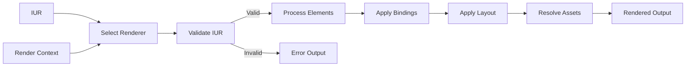

# Ash UI Rendering

This directory contains specifications for IUR → Output rendering.

## Rendering Overview

The rendering layer transforms Intermediate UI Representation (IUR) into target output formats for different platforms.

## Renderers

### LiveView Renderer (rendering/liveview.md)

Renders IUR to Phoenix LiveView HEEx templates.

**Features**:
- Reactive bindings via LiveView assigns
- Event handling via phx-* bindings
- Optimized patches for updates

### Static Renderer (rendering/static.md)

Renders IUR to standalone HTML documents.

**Features**:
- Complete HTML5 document structure
- Inline CSS/JS or external links
- SEO-friendly markup

### Renderer Registry (rendering/registry.md)

Manages renderer registration and selection.

**Features**:
- Dynamic renderer registration
- Format-based renderer selection
- Renderer capability queries

## Rendering Pipeline



## Renderer Contract

```elixir
defbehaviour AshUI.Renderer do
  @callback render(IUR.t(), keyword()) :: {:ok, RendererOutput.t()} | {:error, term()}
  @callback can_render?(IUR.t()) :: boolean()
  @callback format() :: atom()
  @callback supports_binding?(BindingRef.t()) :: boolean()
end
```

## Output Formats

| Format | Renderer | Use Case |
|---|---|---|
| `:liveview` | LiveViewRenderer | Interactive web UI |
| `:html` | StaticRenderer | Static pages, SEO |
| `:json` | JSONRenderer | API responses |
| `:native` | NativeRenderer | Native mobile (future) |

## Related Specifications

- [rendering_contract.md](../contracts/rendering_contract.md)
- [compilation/](../compilation/) - IUR generation
