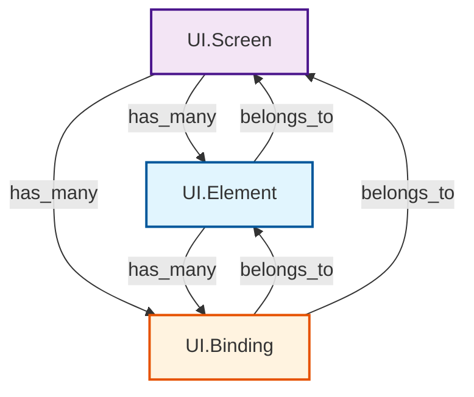

# Ash UI Resources

This directory contains specifications for Ash UI resource types.

## Resource Types

### UI.Element (REQ-RES-ELEMENT)

Atomic UI component with no children.

**Module**: `AshUI.Resources.Element`

**Purpose**: Define the smallest unit of UI - an indivisible component like a button, input, or text display.

**Key Attributes**:
- `id` - UUID primary key
- `type` - Atom identifying component type (:button, :input, :text, etc.)
- `props` - Map of component properties
- `variants` - List of variant atoms for styling
- `metadata` - Additional metadata

**Actions**:
- `read` - Query elements
- `create` - Create new element
- `update` - Update element properties
- `destroy` - Remove element

**Relationships**:
- `belongs_to :screen` - Parent screen
- `has_many :bindings` - Associated bindings

**Specifications**: [ui_element.md](ui_element.md)

### UI.Screen (REQ-RES-SCREEN)

Composable UI container representing a page or view.

**Module**: `AshUI.Resources.Screen`

**Purpose**: Define screens/pages that compose multiple elements into a complete view.

**Key Attributes**:
- `id` - UUID primary key
- `name` - String screen identifier
- `layout` - Atom layout type
- `metadata` - Screen metadata
- `lifecycle_state` - State tracking

**Actions**:
- `read` - Query screens
- `create` - Create new screen
- `update` - Update screen definition
- `destroy` - Remove screen
- `mount` - Lifecycle action for initialization
- `unmount` - Lifecycle action for cleanup

**Relationships**:
- `has_many :elements` - Child elements
- `has_many :bindings` - Associated bindings

**Specifications**: [ui_screen.md](ui_screen.md)

### UI.Binding (REQ-RES-BINDING)

Data binding connecting UI elements to Ash resources.

**Module**: `AshUI.Resources.Binding`

**Purpose**: Define how UI elements connect to and interact with backend Ash resources.

**Key Attributes**:
- `id` - UUID primary key
- `source` - Resource path string
- `target` - Element property path
- `binding_type` - Type (:value, :list, :action)
- `transform` - Transformation rules

**Actions**:
- `read` - Query bindings
- `create` - Create new binding
- `update` - Update binding configuration
- `destroy` - Remove binding
- `evaluate` - Evaluate binding against data

**Relationships**:
- `belongs_to :element` - Associated element
- `belongs_to :screen` - Parent screen

**Specifications**: [ui_binding.md](ui_binding.md)

## Resource Hierarchy

## Standard Element Types

| Type | Description | Props |
|---|---|---|
| `:button` | Clickable button | label, icon, disabled |
| `:input` | Text input field | value, placeholder, type |
| `:text` | Static text display | content, format |
| `:image` | Image display | src, alt, width, height |
| `:link` | Navigation link | to, label, icon |
| `:form` | Form container | action, method |
| `:table` | Data table | columns, rows |
| `:card` | Content card | title, body, footer |
| `:modal` | Modal dialog | title, content |
| `:list` | List container | items, orientation |

## Standard Binding Types

| Type | Direction | Description |
|---|---|---|
| `:value` | Bidirectional | Single value binding |
| `:list` | Resource → UI | Collection binding |
| `:action` | UI → Resource | Action trigger binding |

## Related Specifications

- [resource_contract.md](../contracts/resource_contract.md)
- [screen_contract.md](../contracts/screen_contract.md)
- [binding_contract.md](../contracts/binding_contract.md)
