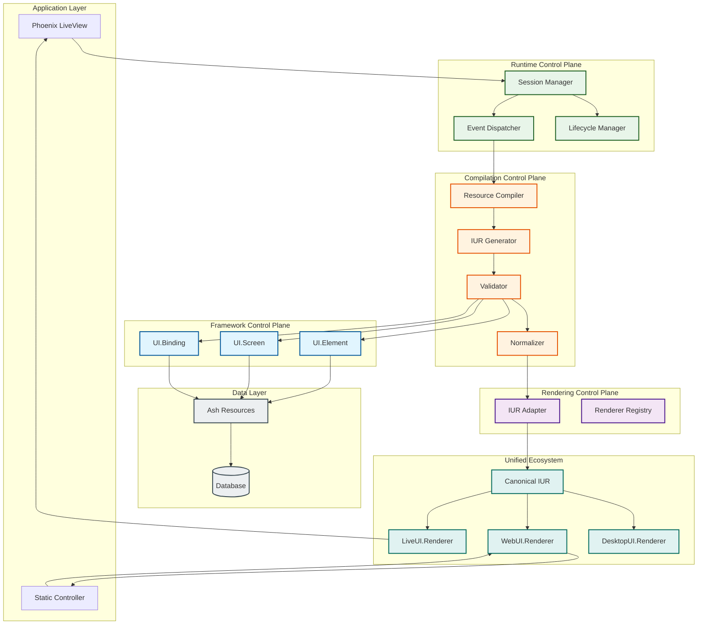
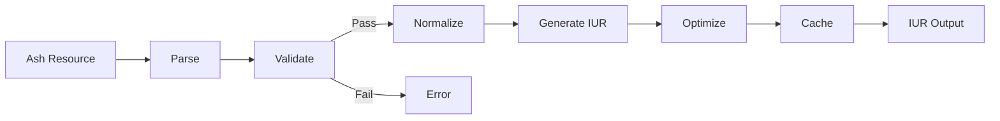
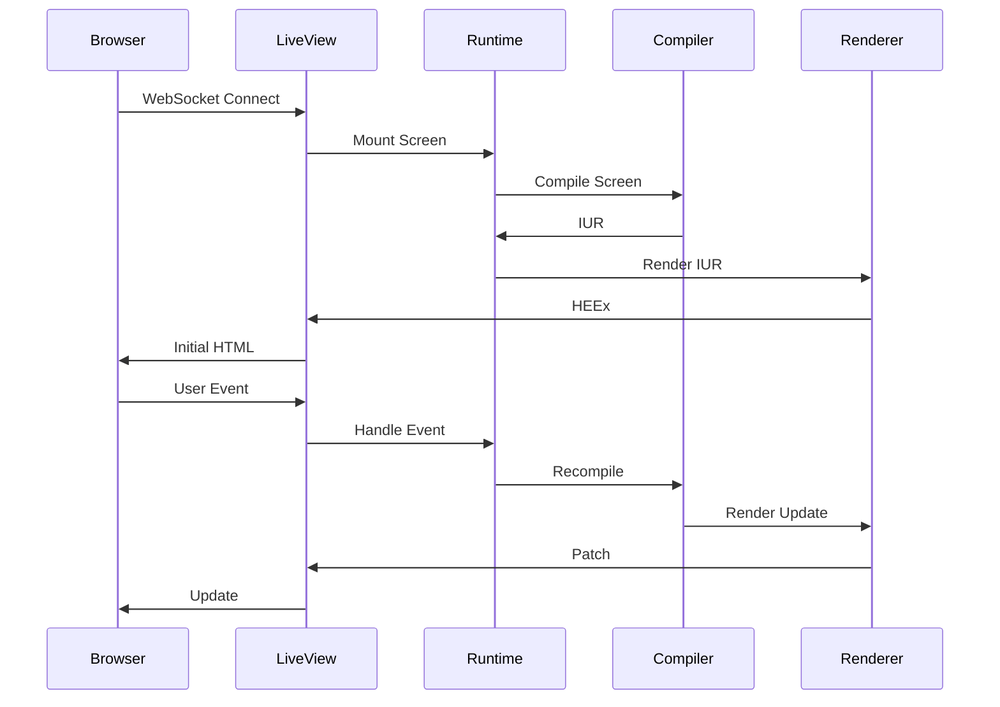

# DG-0001: Ash UI Architecture Overview

---
id: DG-0001
title: Ash UI Architecture Overview
audience: Framework Developers
status: Active
owners: Ash UI Team
last_reviewed: 2026-03-18
next_review: 2026-09-18
related_reqs: [REQ-FRAMEWORK-001, REQ-COMP-001, REQ-RENDER-001]
related_scns: [SCN-101]
related_guides: [UG-0001]
diagram_required: true
---

## Overview

This guide provides a comprehensive overview of the Ash UI architecture for framework contributors. It covers control planes, the compilation pipeline, rendering system, and extension points.

## Prerequisites

Before reading this guide, you should:

- Have strong knowledge of Elixir and OTP
- Understand Ash Framework resources and DSL
- Have read [UG-0001: Getting Started](../user/UG-0001-getting-started.md)

## System Architecture

### High-Level Architecture



## Control Planes

Ash UI is organized into five control planes, each with distinct authority and responsibility.

### Framework Control Plane

**Module**: `AshUI.Framework`

**Authority**: Core resource definitions, type system, action semantics

**Components**:
- `AshUI.Resources.Element` - UI element definitions
- `AshUI.Resources.Screen` - Screen definitions
- `AshUI.Resources.Binding` - Data binding definitions
- `AshUI.DSL` - DSL extensions for resources
- `AshUI.Types` - Custom Ash types

**Key Contract**: [resource_contract.md](../../specs/contracts/resource_contract.md)

### Compilation Control Plane

**Module**: `AshUI.Compilation`

**Authority**: Resource → IUR transformation pipeline

**Components**:
- `AshUI.Compiler.Resource` - Main compiler
- `AshUI.Compiler.IUR` - IUR schema and generation
- `AshUI.Compiler.Validator` - Schema validation
- `AshUI.Compiler.Normalizer` - Representation normalization
- `AshUI.Compiler.Cache` - Compilation caching

**Key Contract**: [compilation_contract.md](../../specs/contracts/compilation_contract.md)

### Rendering Control Plane

**Module**: `AshUI.Rendering`

**Authority**: IUR adaptation and renderer delegation

**Components**:
- `AshUI.Rendering.IURAdapter` - Converts Ash IUR to canonical unified_iur format
- `AshUI.Rendering.Registry` - Manages available renderer packages

**External Renderer Packages** (unified ecosystem):
- `live_ui` - LiveView rendering (https://github.com/your-org/unified/tree/main/packages/live_ui)
- `web_ui` - Static HTML rendering (https://github.com/your-org/unified/tree/main/packages/web_ui)
- `desktop_ui` - Desktop rendering (https://github.com/your-org/unified/tree/main/packages/desktop_ui)

**Key Contract**: [rendering_contract.md](../../specs/contracts/rendering_contract.md)

### Runtime Control Plane

**Module**: `AshUI.Runtime`

**Authority**: Session lifecycle and event handling

**Components**:
- `AshUI.Runtime.Session` - Session management
- `AshUI.Runtime.Event` - Event handling
- `AshUI.Runtime.Lifecycle` - Lifecycle hooks

**Key Contract**: [screen_contract.md](../../specs/contracts/screen_contract.md)

### Extension Control Plane

**Module**: `AshUI.Extension`

**Authority**: Widget and plugin system

**Components**:
- `AshUI.Extension.Widget` - Widget registry
- `AshUI.Extension.Admission` - Plugin admission
- `AshUI.Extension.Loader` - Plugin loading

## Compilation Pipeline

### Pipeline Stages



### Stage Details

1. **Parse** - Extract resource definitions using Ash.Info
2. **Validate** - Verify schema, constraints, and relationships
3. **Normalize** - Standardize attribute order, apply defaults
4. **Generate IUR** - Create Intermediate UI Representation
5. **Optimize** - Apply optimizations (dead code elimination, etc.)
6. **Cache** - Store result for reuse

## Intermediate UI Representation (IUR)

### Ash UI IUR Schema (Internal)

```elixir
%AshUI.Compilation.IUR{
  id: UUID.t(),
  type: :screen | :element,
  name: String.t(),
  attributes: map(),
  children: [%AshUI.Compilation.IUR{}],
  bindings: [%AshUI.Compilation.BindingRef{}],
  metadata: map(),
  version: "1.0.0"
}
```

### Canonical IUR Schema (unified_iur package)

```elixir
%UnifiedIUR.Screen{
  id: UUID.t(),
  elements: [%UnifiedIUR.Element{}],
  layout: UnifiedIUR.Layout.t(),
  signals: [%UnifiedIUR.Signal{}],
  metadata: map()
}
```

### IUR Properties

- **Serializable** - Can be encoded to JSON/binary
- **Immutable** - IUR instances are never modified
- **Self-contained** - All information needed for rendering
- **Versioned** - Schema version for compatibility
- **Convertible** - Ash UI IUR converts to canonical unified_iur format

## Module Namespace

```elixir
AshUI                                   # Application root
├── Application                         # OTP Application
├── Framework                           # Framework Control Plane
│   ├── DSL
│   ├── Types
│   └── Resources
│       ├── Element
│       ├── Screen
│       └── Binding
├── Compilation                         # Compilation Control Plane
│   ├── Compiler
│   ├── IUR
│   ├── Validator
│   ├── Normalizer
│   └── Cache
├── Rendering                           # Rendering Control Plane
│   ├── IURAdapter                      # Ash IUR → Canonical IUR
│   └── Registry                        # Renderer package management
├── Runtime                             # Runtime Control Plane
│   ├── Session
│   ├── Event
│   └── Lifecycle
└── Extension                           # Extension Control Plane
    ├── Widget
    ├── Admission
    └── Loader
```

**External Packages** (unified ecosystem):
- `unified_iur` - Canonical IUR schema and types
- `live_ui` - LiveView renderer
- `web_ui` - Static HTML renderer
- `desktop_ui` - Desktop renderer

## Extension Points

### Custom Element Types

Register custom element types:

```elixir
defmodule MyApp.CustomElement do
  use AshUI.Extension.Widget

  def type, do: :my_custom
  def render(iur, context) do
    # Custom rendering logic
  end
end

AshUI.Extension.Widget.register(:my_custom, MyApp.CustomElement)
```

### Custom Renderers

Custom renderers are implemented via the unified ecosystem packages. To create a custom renderer:

1. **For Ash UI integration**: Ensure your renderer accepts canonical unified_iur format
2. **Implement renderer contract**: Follow the unified ecosystem renderer spec
3. **Register with Ash UI**: Add to renderer registry

```elixir
# Example: Using live_ui renderer
defmodule MyAppWeb.MyLive do
  use Phoenix.LiveView

  def mount(_params, _session, socket) do
    # Compile Ash UI screen
    {:ok, iur} = AshUI.Compilation.compile(:my_screen, %{})

    # Convert to canonical IUR
    {:ok, canonical_iur} = AshUI.Rendering.IURAdapter.to_canonical(iur)

    # Render via live_ui
    {:ok, heex} = LiveUI.Renderer.render(canonical_iur, [])

    {:ok, assign(socket, :content, heex)}
  end
end
```

For creating custom renderer packages, see:
- [Unified Ecosystem Architecture](https://github.com/your-org/unified/blob/main/.spec/specs/architecture.spec.md)
- [Platform Runtimes Spec](https://github.com/your-org/unified/blob/main/.spec/specs/platform_runtimes.spec.md)

## Data Flow

### LiveView Request Flow



## Contributing

### Adding New Element Types

1. Define type in `AshUI.Types`
2. Add validation rules
3. Implement rendering in both renderers
4. Write conformance scenarios
5. Update documentation

### Adding New Control Plane Components

1. Check ownership matrix for authority
2. Create ADR if setting precedent
3. Define requirements (REQ-*)
4. Write scenarios (SCN-*)
5. Implement and document

## See Also

- [Topology](../../specs/topology.md) - Complete system topology
- [Control Plane Ownership](../../specs/contracts/control_plane_ownership_matrix.md) - Ownership details
- [ADR-0001](../../specs/adr/ADR-0001-control-plane-authority.md) - Control plane authority
