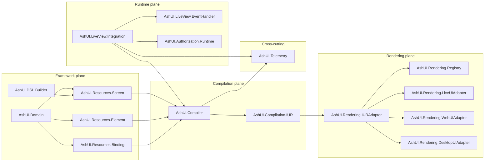

# DG-0001: Ash UI Architecture Overview

---
id: DG-0001
title: Ash UI Architecture Overview
audience: Framework Developers
status: Active
owners: Ash UI Team
last_reviewed: 2026-03-20
next_review: 2026-09-20
related_reqs: [REQ-FRAMEWORK-001, REQ-COMP-001, REQ-RENDER-001, REQ-AUTH-002, REQ-OBS-001]
related_scns: [SCN-041, SCN-061, SCN-081, SCN-101]
related_guides: [UG-0001, UG-0002, UG-0003, DG-0003]
diagram_required: true
---

## Overview

This guide explains the current Ash UI architecture as implemented in this repository. The design has settled into a thin Ash-native control layer around stored UI resources, compiler output, canonical IUR conversion, runtime authorization, and renderer adapters.

## Prerequisites

Before reading this guide, you should:

- Know Ash resources, domains, and AshPostgres basics
- Be comfortable reading Phoenix LiveView integration code
- Have read [UG-0001: Getting Started](../user/UG-0001-getting-started.md)

## System Shape

Ash UI is organized around five control planes, but the codebase is intentionally practical about where responsibilities live today.

## Architectural Center of Gravity

The earlier specs describe first-class `UI.Screen`, `UI.Element`, and `UI.Binding` DSL-driven definitions. The implemented code still uses those resource concepts, but the operational center of gravity is now:

1. Persist screen state in Ash resources.
2. Store nested UI structure in `Screen.unified_dsl`.
3. Compile into `AshUI.Compilation.IUR`.
4. Convert into canonical renderer input.
5. Mount and authorize through LiveView runtime helpers.

That means contributors should treat `unified_dsl` plus compiler/runtime boundaries as the most important integration seam.

## Framework Plane

The framework plane owns durable UI definitions.

Primary modules:

- `AshUI.Domain`
- `AshUI.Resources.Screen`
- `AshUI.Resources.Element`
- `AshUI.Resources.Binding`
- `AshUI.DSL.Builder`
- `AshUI.DSL.Storage`

Important details:

- `Screen` stores `name`, `route`, `layout`, `unified_dsl`, and metadata.
- `Element` and `Binding` provide relational structure for querying and runtime behavior.
- updates increment `version`, which feeds cache and rollout safety checks.

## Compilation Plane

The compilation plane turns Ash UI resources into internal IUR.

Primary modules:

- `AshUI.Compiler`
- `AshUI.Compilation.IUR`
- `AshUI.Compiler.Extensions`
- `AshUI.Compiler.Incremental`

There are two active compilation paths:

- compile from `Screen.unified_dsl`
- compile from relational screen, element, and binding records

`AshUI.Compiler` also owns:

- ETS-backed compilation cache
- batch compilation helpers
- cache invalidation hooks
- telemetry for compile start, completion, and failure

## Runtime Plane

The runtime plane wires Ash UI into LiveView and binding updates.

Primary modules:

- `AshUI.LiveView.Integration`
- `AshUI.LiveView.EventHandler`
- `AshUI.LiveView.Hooks`
- `AshUI.LiveView.UpdateIntegration`
- `AshUI.Runtime.BindingEvaluator`
- `AshUI.Runtime.BidirectionalBinding`
- `AshUI.Runtime.ActionBinding`

The mount flow is:

1. read `:current_user` from the socket
2. load a screen by ID or by `name`
3. authorize mount
4. compile screen to IUR and canonical IUR
5. evaluate bindings
6. assign screen state onto the socket

This flow is currently the best place to inspect end-to-end behavior when debugging regressions.

## Authorization Plane Responsibilities

Authorization is cross-cutting, but runtime enforcement is centralized in:

- `AshUI.Authorization.Runtime`
- `AshUI.Authorization.ScreenPolicy`
- `AshUI.Authorization.ElementPolicy`
- `AshUI.Authorization.BindingPolicy`

Current notable behavior:

- no implicit dev/test bypass
- explicit `:runtime_authorization_bypass` configuration exists
- inactive users are denied before protected operations continue
- authorization emits telemetry and uses ETS caching

## Rendering Plane

Ash UI does not own the final renderer implementation. It owns the conversion and integration boundary.

Primary modules:

- `AshUI.Rendering.IURAdapter`
- `AshUI.Rendering.Registry`
- `AshUI.Rendering.Selector`
- `AshUI.Rendering.LiveUIAdapter`
- `AshUI.Rendering.WebUIAdapter`
- `AshUI.Rendering.DesktopUIAdapter`

The adapters currently support two operating modes:

- delegate to external renderer packages if those modules are installed
- fall back to local adapter output when those packages are absent

That fallback behavior is intentional and is part of current release-readiness work.

## Observability

`AshUI.Telemetry` is the canonical telemetry catalog and default metrics aggregator.

Major event families:

- screen lifecycle
- binding evaluation and update
- compilation
- rendering
- authorization

Dashboards under `priv/monitoring/dashboards/` consume the normalized telemetry shape rather than ad-hoc event names.

## Design Constraints Contributors Should Respect

- Preserve the control-plane boundary: framework data in resources, renderer behavior in adapters.
- Keep canonical IUR as the renderer contract.
- Prefer additive docs and tests when changing behavior that has spec implications.
- When runtime behavior diverges from long-range RFC language, document the current state clearly rather than hiding the transition.

## Common Debugging Entry Points

- `AshUI.LiveView.Integration.mount_ui_screen/3` for mount failures
- `AshUI.Compiler.compile/2` for IUR regressions
- `AshUI.Rendering.IURAdapter.to_canonical/2` for renderer boundary issues
- `AshUI.Authorization.Runtime` for access failures
- `AshUI.Telemetry.snapshot/0` for observability checks

## See Also

- [UG-0001: Getting Started](../user/UG-0001-getting-started.md)
- [DG-0003: Testing Guide](./DG-0003-testing-guide.md)
- [topology.md](../../specs/topology.md)
- [ADR-0001-control-plane-authority.md](../../specs/adr/ADR-0001-control-plane-authority.md)
