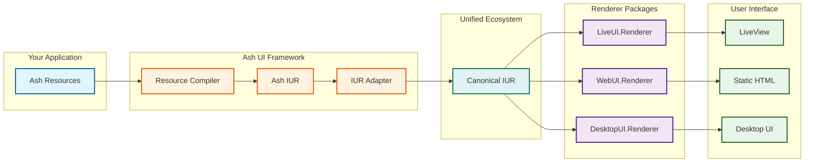

# UG-0001: Getting Started with Ash UI

---
id: UG-0001
title: Getting Started with Ash UI
audience: Application Developers
status: Active
owners: Ash UI Team
last_reviewed: 2026-03-18
next_review: 2026-09-18
related_reqs: [REQ-RES-001, REQ-SCREEN-001]
related_scns: [SCN-001, SCN-004]
related_guides: []
diagram_required: true
---

## Overview

This guide introduces Ash UI, a resource-driven UI framework for Elixir built on the Ash Framework. Ash UI enables dynamic UI generation from database resources through the unified UI rendering ecosystem.

## What is Ash UI?

Ash UI is a framework that:

- **Defines UI as Resources** - UI components are Ash resources stored in your database
- **Compiles to IUR** - Resources are compiled to an Intermediate UI Representation
- **Converts to Canonical IUR** - IUR is converted to canonical unified_iur format
- **Renders via Unified Packages** - Output to LiveView, static HTML, or desktop via external renderer packages
- **Binds Data Reactively** - Connect UI elements directly to Ash resources

## Architecture Overview



## Prerequisites

Before using Ash UI, you should have:

- **Elixir 1.15+** installed
- **Phoenix 2.0+** application
- **Ash Framework 3.0+** installed
- Basic knowledge of Ash resources

## Installation

Add Ash UI and dependencies to your `mix.exs`:

```elixir
# mix.exs
defp deps do
  [
    {:ash_ui, "~> 0.1"},
    {:unified_iur, "~> 0.1"},  # Canonical IUR format
    {:live_ui, "~> 0.1"},      # LiveView renderer (choose one)
    # {:web_ui, "~> 0.1"}      # Static HTML renderer (alternative)
    # {:desktop_ui, "~> 0.1"}  # Desktop renderer (alternative)
    {:ash, "~> 3.0"},
    {:phoenix_live_view, "~> 1.0"}
  ]
end
```

Install and configure:

```bash
mix deps.get
```

## Your First Screen

### Step 1: Define a Screen Resource

Create a screen resource using the Ash DSL:

```elixir
defmodule MyApp.UI.Dashboard do
  use Ash.Resource,
    domain: MyApp.UI,
    data_layer: AshPostgres.DataLayer

  ui_screen do
    layout :dashboard
    route "/dashboard"
  end

  actions do
    defaults [:read, :create, :update, :destroy]

    action :mount do
      argument :user_id, :uuid
      run {AshUI.Screen.Actions, :mount_screen}
    end
  end
end
```

### Step 2: Define UI Elements

Add elements to your screen:

```elixir
defmodule MyApp.UI.Elements.WelcomeText do
  use Ash.Resource,
    domain: MyApp.UI,
    data_layer: AshPostgres.DataLayer

  ui_element do
    type :text
    props %{
      content: "Welcome to Ash UI!",
      size: :large
    }
  end
end
```

### Step 3: Create Data Bindings

Connect elements to your data:

```elixir
defmodule MyApp.UI.Bindings.UserName do
  use Ash.Resource,
    domain: MyApp.UI,
    data_layer: AshPostgres.DataLayer

  attributes do
    uuid_primary_key :id
    attribute :source, :string, default: "MyApp.Accounts.User.name"
    attribute :target, :string, default: "element.value"
    attribute :binding_type, :atom, default: :value
  end
end
```

### Step 4: Mount in LiveView

```elixir
defmodule MyAppWeb.DashboardLive do
  use MyAppWeb, :live_view

  def mount(params, _session, socket) do
    {:ok, mount_ui_screen(socket, :dashboard, params)}
  end
end
```

The `mount_ui_screen/3` helper handles compilation, IUR conversion, and rendering via your configured renderer package (e.g., `live_ui`).

## Core Concepts

### UI.Element

The atomic unit of UI - a single component like a button, input, or text.

```elixir
ui_element do
  type :button
  props %{
    label: "Click Me",
    variant: :primary
  }
end
```

### UI.Screen

A composable container representing a page or view.

```elixir
ui_screen do
  layout :default
  route "/my-screen"
end
```

### UI.Binding

Connects UI elements to Ash resources.

```elixir
# Binds element value to user name
source: "MyApp.Accounts.User.name"
target: "element.value"
binding_type: :value
```

## Common UI Element Types

| Type | Description | Example Props |
|---|---|---|
| `:text` | Static text | content, format |
| `:button` | Clickable button | label, variant, disabled |
| `:input` | Text input | placeholder, type, value |
| `:image` | Image display | src, alt, width, height |

## Next Steps

- **[UG-0002: Resources](UG-0002-resources.md)** - Deep dive into UI resources
- **[UG-0003: Data Binding](UG-0003-data-binding.md)** - Reactive data binding
- **[DG-0001: Architecture](../developer/DG-0001-architecture-overview.md)** - Framework internals

## Troubleshooting

### Screen doesn't mount

Ensure your screen has a `:mount` action and the route is defined in your Phoenix router.

### Elements don't appear

Check that elements have the correct `type` and are associated with the screen.

### Binding not working

Verify the `source` path points to a valid Ash resource attribute.

## See Also

- [Ash Framework Documentation](https://hexdocs.pm/ash)
- [Phoenix LiveView Guide](https://hexdocs.pm/phoenix_live_view)
- [Specifications](../../specs/) - Technical specifications
