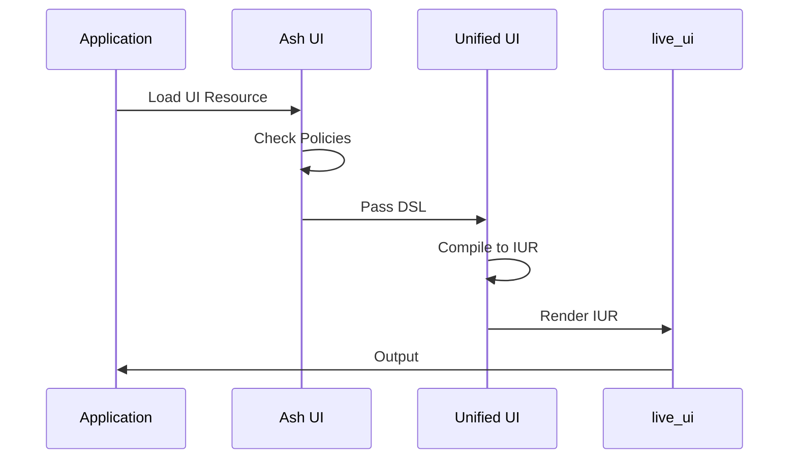

# RFC-0002: Ash UI as an Ash Framework Integration Layer for unified-ui

**Status**: Draft
**Phase**: 1
**Authors**: Ash UI Team
**Created**: 2026-03-19
**Modified**: 2026-03-19
**Replaces**: N/A
**Replaced By**: N/A

---

## Summary

Reposition Ash UI as an **Ash Framework integration layer** for the unified-ui ecosystem, rather than defining parallel UI concepts. Ash UI's unique value is storing unified-ui definitions as Ash Resources with Ash authorization, actions, and data binding — while delegating widgets, layouts, styling, compilation, and rendering to the unified-ui packages.

## Motivation

### Problem Statement

The current Ash UI architecture defines its own UI concepts (`UI.Screen`, `UI.Element`, `UI.Binding`) that parallel the unified-ui ecosystem. This creates:

1. **Conceptual duplication** - Two ways to define the same UI constructs
2. **Maintenance burden** - Need to sync Ash UI concepts with unified-ui changes
3. **Confusion for users** - Which widget/layout concepts should they use?
4. **Fragmentation** - Ash UI cannot benefit from unified-ui ecosystem growth

### Current Limitations

- `UI.Screen` duplicates unified-ui's root element + layout composition
- `UI.Element` invents widget types instead of using unified-ui widgets
- `UI.Binding` is Ash-specific but doesn't integrate cleanly with unified-ui signals
- Compilation pipeline duplicates unified-ui compiler work
- No clear boundary between "Ash concerns" and "UI concerns"

### Proposed Solution

**Ash UI = unified-ui + Ash Framework integration**

```
┌─────────────────────────────────────────────────────────────┐
│                        Ash UI                                │
│  ┌─────────────────────────────────────────────────────┐   │
│  │              Ash-Specific Layer                      │   │
│  │  • UI definitions stored as Ash Resources             │   │
│  │  • Ash policies for authorization                    │   │
│  │  • Ash actions for CRUD operations                   │   │
│  │  • Data binding to Ash resources                     │   │
│  └─────────────────────────────────────────────────────┘   │
│                          ↓                                  │
│  ┌─────────────────────────────────────────────────────┐   │
│  │              Adapter Layer                           │   │
│  │  • Ash Resource → unified-ui DSL                    │   │
│  │  • Ash data → unified-ui signals                    │   │
│  │  • Ash policies → unified-ui visibility             │   │
│  └─────────────────────────────────────────────────────┘   │
└─────────────────────────────────────────────────────────────┘
                          ↓
┌─────────────────────────────────────────────────────────────┐
│                    Unified UI Ecosystem                      │
│  • unified-ui: DSL, widgets, layouts, styling, theming     │
│  • unified_iur: Canonical intermediate representation        │
│  • live_ui, web_ui, desktop_ui: Renderer packages           │
└─────────────────────────────────────────────────────────────┘
```

## Proposed Design

### Overview

Ash UI becomes a **thin integration layer** that:

1. **Stores** unified-ui DSL definitions as Ash Resources
2. **Authorizes** UI access via Ash policies
3. **Binds** UI data to Ash resources
4. **Adapts** Ash concerns to unified-ui concepts
5. **Delegates** everything else (widgets, layouts, compilation, rendering) to unified-ui

### Technical Details

#### Resource Structure

```elixir
# Ash UI stores unified-ui definitions as Ash Resources
defmodule MyApp.UI.DashboardScreen do
  use Ash.Resource,
    domain: MyApp.UI,
    data_layer: AshPostgres.DataLayer

  # The unified-ui DSL is stored in an attribute
  attributes do
    uuid_primary_key :id
    attribute :name, :string
    attribute :unified_dsl, :map do
      # Stores unified-ui DSL structure:
      # %{
      #   root: %{type: :row, children: [...]},
      #   styles: %{...},
      #   signals: %{...}
      # }
    end
    attribute :version, :integer
  end

  # Ash authorization for UI access
  policies do
    policy always() do
      authorize_if expr(user.role == :admin)
    end
  end

  # Ash actions for UI CRUD
  actions do
    defaults [:read, :create, :update, :destroy]
  end
end
```

#### Data Binding

```elixir
# Ash data binding to unified-ui signals
defmodule AshUI.Data.Binding do
  @moduledoc """
  Binds Ash resources to unified-ui signals.
  """

  def bind_signal(%Ash.Resource{} = resource, signal_path) do
    # Converts Ash resource references to unified-ui signal format
    %UnifiedIUR.Signal{
      source: "ash:#{inspect(resource)}:#{signal_path}",
      type: :value,
      transform: &Ash.read!/1
    }
  end
end
```

#### API Usage

```elixir
# Before: Ash UI DSL
defmodule MyApp.UI.Dashboard do
  use Ash.Resource

  ui_screen do
    layout :dashboard
    elements [...]
  end
end

# After: unified-ui DSL stored as Ash Resource
defmodule MyApp.UI.Dashboard do
  use Ash.Resource

  attributes do
    attribute :unified_dsl, :map
  end

  # Use unified-ui directly
  def unified_dsl do
    %UnifiedUI.Root{
      type: :row,
      children: [
        UnifiedUI.text("Welcome"),
        UnifiedUI.button("Click", on_click: [...] )
      ]
    }
  end
end
```

#### Compilation Flow



### API Changes

```elixir
# New Ash API
defmodule AshUI.Resource do
  @moduledoc """
  Helpers for using unified-ui with Ash Resources.
  """

  defmacro __using__(_opts) do
    quote do
      # Store unified-ui DSL
      attribute :unified_dsl, :map

      # Ash policies for UI access
      policies do
        policy action(:render) do
          authorize_if expr(user.active)
        end
      end
    end
  end
end

# Usage
defmodule MyApp.UI.Dashboard do
  use Ash.Resource
  use AshUI.Resource

  unified_ui do
    # Direct unified-ui DSL here
    root do
      row do
        text "Welcome"
        button "Click", on_click: Signal.new(...)
      end
    end
  end
end
```

### Migration Path

1. **Phase 1**: Add adapter layer to existing Ash UI
2. **Phase 2**: Deprecate `ui_screen`/`ui_element` DSL in favor of `unified_ui`
3. **Phase 3**: Remove old DSL after deprecation period
4. **Phase 4**: Ash UI becomes pure integration layer

### Performance Impact

- **Positive**: Less code to maintain in Ash UI
- **Positive**: Benefiting from unified-ui optimizations
- **Neutral**: Adapter layer adds minimal overhead
- **Negative**: Initial migration cost

## Governance Mapping

### Requirements

| REQ ID | Description | Contract |
|---|---|---|
| REQ-ASHUI-001 | Ash UI must store unified-ui DSL as Ash Resources | resource_contract.md (revised) |
| REQ-ASHUI-002 | Ash UI must authorize UI access via Ash policies | authorization_contract.md |
| REQ-ASHUI-003 | Ash UI must bind Ash data to unified-ui signals | binding_contract.md (revised) |
| REQ-ASHUI-004 | Ash UI must not define widget/layout types | Removed (delegated to unified-ui) |
| REQ-ASHUI-005 | Ash UI must adapt Ash resources to unified-ui DSL | adapter_contract.md (new) |

### Scenarios

| SCN ID | Description | Status |
|---|---|---|
| SCN-ASHUI-001 | Load unified-ui definition from Ash Resource | Draft |
| SCN-ASHUI-002 | Authorize UI access via Ash policies | Draft |
| SCN-ASHUI-003 | Bind Ash resource data to UI signals | Draft |
| SCN-ASHUI-004 | Compile unified-ui DSL to IUR | Draft |
| SCN-ASHUI-005 | Render via live_ui/web_ui packages | Draft |

### Contracts

- **Modified**: resource_contract.md (stores unified-ui DSL)
- **Modified**: authorization_contract.md (Ash policies for UI)
- **Modified**: binding_contract.md (Ash data → unified signals)
- **Modified**: compilation_contract.md (uses unified-ui compiler)
- **Removed**: screen_contract.md (replaced by unified-ui root)
- **Removed**: element_contract.md (replaced by unified-ui widgets)
- **New**: adapter_contract.md (Ash ↔ unified-ui adaptation)

### ADRs

- **New**: ADR-0002 - Ash UI Architecture (redefines Ash UI as integration layer)
- **Modified**: ADR-0001 - Update to reflect new architecture

## Spec Creation Plan

| Spec | Type | Status | Priority |
|---|---|---|---|
| adapter_contract.md | Contract | Draft | P0 |
| resource_contract.md (revised) | Contract | Draft | P0 |
| binding_contract.md (revised) | Contract | Draft | P0 |
| topology.md (revised) | Component | Draft | P0 |
| UG-0001 (revised) | Guide | Draft | P1 |
| DG-0001 (revised) | Guide | Draft | P1 |

## Alternatives

### Alternative 1: Keep Parallel Concepts (Current)

Continue defining Ash-specific UI concepts alongside unified-ui.

**Pros**:
- No migration work
- Full control over Ash-specific UI needs

**Cons**:
- Duplicates unified-ui work
- Confusing for users
- Maintenance burden
- Cannot benefit from unified-ui ecosystem growth

### Alternative 2: Replace with unified-ui Entirely

Drop Ash UI entirely; tell users to use unified-ui directly with their own Ash integration.

**Pros**:
- Cleanest separation

**Cons**:
- Each app builds their own integration
- No shared Ash authorization patterns
- No community around Ash + unified-ui

### Alternative 3: Ash UI Becomes unified-ui Extension

Build Ash UI as an official unified-ui extension for Ash Framework.

**Pros**:
- Official unified-ui ecosystem presence
- Shared governance

**Cons**:
- Adds overhead of cross-repo coordination
- Unified-ui may not want Ash-specific code

### Rejected Alternatives

**Alternative 1** was rejected because the long-term maintenance cost outweighs short-term convenience.

**Alternative 2** was rejected because it pushes integration work onto each application.

**Alternative 3** may be considered in the future after initial integration proves successful.

## Unresolved Questions

1. How do we handle existing `ui_screen`/`ui_element` definitions during migration?
2. Should Ash UI provide migration tools from old DSL to unified-ui DSL?
3. How do we handle Ash-specific features (like authorization) that unified-ui doesn't have?
4. What's the timeline for deprecating old DSL?

## Implementation Plan

### Milestones

| Milestone | Description | Status |
|---|---|---|
| M1 | RFC accepted | Pending |
| M2 | Create adapter_contract.md | Pending |
| M3 | Revise resource_contract.md | Pending |
| M4 | Update topology.md | Pending |
| M5 | Create migration guide | Pending |
| M6 | Implement adapter layer | Pending |
| M7 | Deprecate old DSL | Pending |

### Tasks

- [ ] RFC review and approval
- [ ] Create adapter_contract.md spec
- [ ] Revise resource_contract.md for unified-ui storage
- [ ] Revise binding_contract.md for unified-ui signals
- [ ] Update topology.md architecture diagram
- [ ] Update ADR-0001
- [ ] Create ADR-0002
- [ ] Write migration guide
- [ ] Implement Ash ↔ unified-ui adapter
- [ ] Add deprecation warnings to old DSL
- [ ] Update user and developer guides
- [ ] Update scenario catalog

## References

- [unified-ui Architecture](https://github.com/your-org/unified/blob/main/.spec/specs/architecture.spec.md)
- [unified-ui Widgets](https://github.com/your-org/unified/blob/main/.spec/specs/unified-ui/widgets.spec.md)
- [unified-iur Constructs](https://github.com/your-org/unified/blob/main/.spec/specs/unified-iur/constructs.spec.md)
- [RFC-0001: Ash UI Governance System](RFC-0001-ash-ui-governance-system.md)
- [ADR-0001: Control Plane Authority](../specs/adr/ADR-0001-control-plane-authority.md)

---

## Changelog

### 2026-03-19
- Initial draft
