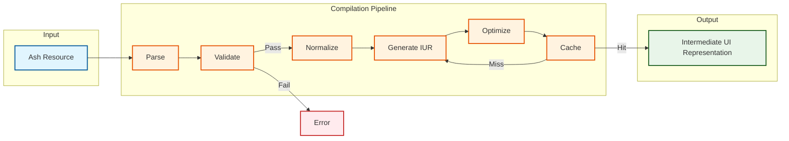
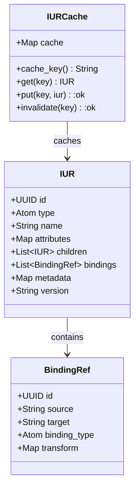

# Compilation Contract (REQ-COMP-*)

This contract defines the normative requirements for Resource → IUR → canonical IUR compilation in the Ash UI framework.

## Purpose

Defines the requirements for compiling Ash UI resources (UI.Element, UI.Screen, UI.Binding) into the Intermediate UI Representation (IUR), and then converting to canonical `unified_iur` format for consumption by external renderer packages.

## Control Plane

**Owner**: `AshUI.Compilation` (Compilation Control Plane)

## Dependencies

- REQ-RES-*: Source resource definitions
- REQ-FRAMEWORK-*: Framework contracts
- **unified_iur** - Canonical intermediate representation format (external package)

## Requirements

### REQ-COMP-001: Compilation Pipeline

Resources MUST be compiled through a defined pipeline of stages.

**Compilation Stages**:
1. **Parse** - Extract resource definitions
2. **Validate** - Verify schema and constraints
3. **Normalize** - Standardize representation
4. **Generate IUR** - Produce intermediate representation
5. **Optimize** - Apply optimizations
6. **Cache** - Store compiled result

**Acceptance Criteria**:
- AC-001: All stages execute in order
- AC-002: Each stage produces valid output for the next
- AC-003: Pipeline failures produce clear error messages
- AC-004: Pipeline can be configured/extended

### REQ-COMP-002: Schema Validation

Resource schemas MUST be validated before IUR generation.

**Validation Rules**:
- Required attributes are present
- Attribute types are valid
- Relationships are properly defined
- Actions are properly configured
- No circular dependencies

**Acceptance Criteria**:
- AC-001: Invalid schemas produce compilation errors
- AC-002: Error messages indicate the specific issue
- AC-003: Validation completes before IUR generation
- AC-004: Validation can be skipped (unsafe mode)

### REQ-COMP-003: IUR Schema

The Intermediate UI Representation MUST have a defined schema compatible with canonical `unified_iur`.

**IUR Structure** (Ash UI internal):
```elixir
%AshUI.Compilation.IUR{
  id: UUID.t(),
  type: :screen | :element,
  name: String.t(),
  attributes: map(),
  children: [%AshUI.Compilation.IUR{}],
  bindings: [%AshUI.Compilation.BindingRef{}],
  metadata: map()
}
```

**Canonical IUR Structure** (unified_iur package):
```elixir
%UnifiedIUR.Screen{
  id: UUID.t(),
  elements: [%UnifiedIUR.Element{}],
  layout: UnifiedIUR.Layout.t(),
  signals: [%UnifiedIUR.Signal{}],
  metadata: map()
}
```

**Acceptance Criteria**:
- AC-001: Ash UI IUR is convertible to canonical unified_iur
- AC-002: IUR is serializable (to JSON/binary)
- AC-003: IUR contains all required information for canonical conversion
- AC-004: IUR is independent of source resource format

### REQ-COMP-004: Resource Resolution

Compilation MUST resolve all resource references.

**Resolution Targets**:
- Element type references
- Screen layout references
- Binding source/target references
- Action references

**Acceptance Criteria**:
- AC-001: All references are resolved at compile time
- AC-002: Unresolvable references produce errors
- AC-003: Resolution caches results
- AC-004: Circular references are detected

### REQ-COMP-005: Normalization

Compilation MUST normalize resource representations.

**Normalization Rules**:
- Attribute ordering is consistent
- Default values are applied
- Inherited properties are merged
- Redundant data is eliminated

**Acceptance Criteria**:
- AC-001: Equivalent resources produce identical IUR
- AC-002: Normalization is deterministic
- AC-003: Normalization preserves semantic meaning
- AC-004: Normalization can be disabled (debug mode)

### REQ-COMP-006: Optimization

Compilation MAY apply optimizations to generated IUR.

**Optimization Types**:
- Dead code elimination
- Constant folding
- Tree shaking
- Memoization

**Acceptance Criteria**:
- AC-001: Optimizations don't change semantic meaning
- AC-002: Optimizations can be disabled
- AC-003: Optimization passes are documented
- AC-004: Optimization results are measurable

### REQ-COMP-007: Caching

Compilation MUST cache compiled IUR for performance.

**Cache Keys**:
- Resource ID
- Resource version
- Compilation options
- Dependency hash

**Acceptance Criteria**:
- AC-001: Cache hits skip pipeline stages
- AC-002: Cache invalidates when resources change
- AC-003: Cache has configurable size limits
- AC-004: Cache can be cleared

### REQ-COMP-008: Error Reporting

Compilation errors MUST be clear and actionable.

**Error Information**:
- Resource identifier
- Stage where error occurred
- Specific issue description
- Suggested fixes

**Acceptance Criteria**:
- AC-001: Errors include stack traces
- AC-002: Errors are formatted for readability
- AC-003: Multiple errors are reported together
- AC-004: Warnings are distinguished from errors

### REQ-COMP-009: Incremental Compilation

Compilation SHOULD support incremental updates.

**Incremental Strategy**:
- Track resource dependencies
- Recompile only changed resources
- Propagate changes to dependents

**Acceptance Criteria**:
- AC-001: Changed resources trigger recompilation
- AC-002: Unchanged resources use cached IUR
- AC-003: Dependency tracking is automatic
- AC-004: Dependency cycles are detected

### REQ-COMP-010: Observability

Compilation MUST emit telemetry events.

**Event Types**:
- Compilation started
- Compilation completed
- Cache hit/miss
- Error occurred

**Acceptance Criteria**:
- AC-001: Events include resource ID
- AC-002: Events include duration
- AC-003: Events include stage information
- AC-004: Events follow standard telemetry schema

## Compilation Pipeline



## IUR Schema



## Traceability

| Requirement | ADR | Component Spec | Scenarios |
|---|---|---|---|
| REQ-COMP-001 | ADR-0007 | compilation/compiler.md | SCN-301, SCN-302 |
| REQ-COMP-002 | ADR-0007 | compilation/validator.md | SCN-303, SCN-304 |
| REQ-COMP-003 | ADR-0008 | compilation/iur.md | SCN-305 |
| REQ-COMP-004 | - | compilation/resolver.md | SCN-306, SCN-307 |
| REQ-COMP-005 | - | compilation/normalizer.md | SCN-308 |
| REQ-COMP-006 | ADR-0009 | compilation/optimizer.md | SCN-309 |
| REQ-COMP-007 | - | compilation/cache.md | SCN-310, SCN-311 |
| REQ-COMP-008 | - | compilation/errors.md | SCN-312 |
| REQ-COMP-009 | ADR-0010 | compilation/incremental.md | SCN-313, SCN-314 |
| REQ-COMP-010 | - | observability_contract.md | SCN-315 |

## Conformance

See [conformance/spec_conformance_matrix.md](../conformance/spec_conformance_matrix.md) for complete scenario mappings.

## Related Specifications

- [topology.md](../topology.md)
- [resource_contract.md](resource_contract.md)
- [rendering_contract.md](rendering_contract.md)
