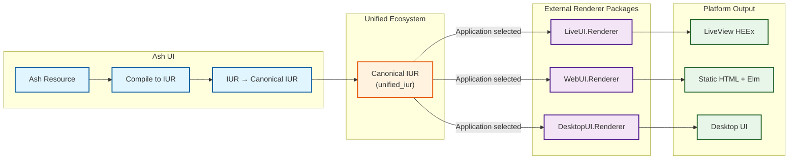
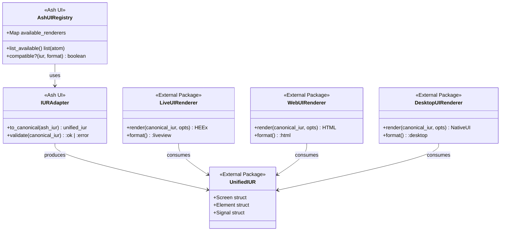

# Rendering Contract (REQ-RENDER-*)

This contract defines the normative requirements for IUR → unified_iur → Output rendering in the Ash UI framework.

## Purpose

Defines the requirements for compiling Ash UI resources to canonical `unified_iur` format and delegating rendering to external unified renderer packages (live_ui, web_ui, desktop_ui).

## Control Plane

**Owner**: `AshUI.Rendering` (Rendering Control Plane)

## External Dependencies

- **unified_iur**: Canonical intermediate representation format (https://github.com/your-org/unified/tree/main/packages/unified_iur)
- **live_ui**: LiveView renderer package (https://github.com/your-org/unified/tree/main/packages/live_ui)
- **web_ui**: Static HTML renderer package (https://github.com/your-org/unified/tree/main/packages/web_ui)
- **desktop_ui**: Desktop renderer package (https://github.com/your-org/unified/tree/main/packages/desktop_ui)

## Internal Dependencies

- REQ-COMP-*: IUR definitions
- REQ-FRAMEWORK-*: Framework contracts

## Requirements

### REQ-RENDER-001: Canonical IUR Production

Ash UI MUST produce canonical `unified_iur` format for consumption by external renderer packages.

**IUR Adapter Contract**:
```elixir
defmodule AshUI.Rendering.IURAdapter do
  @doc """
  Converts Ash UI IUR to canonical unified_iur format.
  """
  @callback to_canonical(AshUI.Compilation.IUR.t()) :: {:ok, UnifiedIUR.Screen.t()} | {:error, term()}

  @doc """
  Validates that the IUR is compatible with the target renderer.
  """
  @callback compatible?(AshUI.Compilation.IUR.t(), atom()) :: boolean()
end
```

**External Renderer Invocation**:
```elixir
# Application selects renderer
case renderer_type do
  :liveview -> LiveUI.Renderer.render(canonical_iur, opts)
  :html -> WebUI.Renderer.render(canonical_iur, opts)
  :desktop -> DesktopUI.Renderer.render(canonical_iur, opts)
end
```

**Acceptance Criteria**:
- AC-001: Ash UI produces canonical unified_iur format
- AC-002: External renderer packages consume IUR without Ash dependencies
- AC-003: IUR adapter validates compatibility before rendering
- AC-004: Renderer packages are selected by application, not Ash UI

### REQ-RENDER-002: LiveView Rendering (via live_ui)

LiveView rendering is provided by the external `live_ui` package.

**Package**: `live_ui` (https://github.com/your-org/unified/tree/main/packages/live_ui)

**Requirements**:
- Ash UI produces canonical IUR compatible with live_ui
- live_ui accepts canonical IUR via `LiveUI.Renderer.render/2`
- Output format is LiveView HEEx templates

**Acceptance Criteria**:
- AC-001: Ash UI IUR maps to valid canonical IUR for live_ui
- AC-002: live_ui produces valid HEEx output
- AC-003: Events are bound according to unified signal transport contract
- AC-004: HTML is properly escaped by live_ui

**Note**: See [live_ui IUR Renderer spec](https://github.com/your-org/unified/blob/main/.spec/specs/live_ui/iur_renderer.spec.md) for canonical IUR requirements.

### REQ-RENDER-003: Static HTML Rendering (via web_ui)

Static HTML rendering is provided by the external `web_ui` package.

**Package**: `web_ui` (https://github.com/your-org/unified/tree/main/packages/web_ui)

**Requirements**:
- Ash UI produces canonical IUR compatible with web_ui
- web_ui accepts canonical IUR via `WebUI.Renderer.render/2`
- Output format is static HTML5 with optional Elm client

**Acceptance Criteria**:
- AC-001: Ash UI IUR maps to valid canonical IUR for web_ui
- AC-002: web_ui produces valid HTML5 output
- AC-003: Document structure follows web_ui conventions
- AC-004: Assets are properly referenced

**Note**: See [web_ui IUR Renderer spec](https://github.com/your-org/unified/blob/main/.spec/specs/web_ui/iur_renderer.spec.md) for canonical IUR requirements.

### REQ-RENDER-003B: Desktop Rendering (via desktop_ui)

Desktop rendering is provided by the external `desktop_ui` package.

**Package**: `desktop_ui` (https://github.com/your-org/unified/tree/main/packages/desktop_ui)

**Requirements**:
- Ash UI produces canonical IUR compatible with desktop_ui
- desktop_ui accepts canonical IUR via `DesktopUI.Renderer.render/2`
- Output format is native desktop UI (SDL2-based)

**Acceptance Criteria**:
- AC-001: Ash UI IUR maps to valid canonical IUR for desktop_ui
- AC-002: desktop_ui produces native desktop widgets
- AC-003: Event handling follows unified signal transport contract
- AC-004: Platform-specific rendering is handled by desktop_ui

**Note**: See [desktop_ui IUR Renderer spec](https://github.com/your-org/unified/blob/main/.spec/specs/desktop_ui/iur_renderer.spec.md) for canonical IUR requirements.

### REQ-RENDER-004: Component Rendering

External renderer packages MUST support rendering individual UI components from canonical IUR.

**Requirements**:
- Canonical IUR allows partial/component rendering
- Renderer packages support fragment rendering
- Component boundaries are preserved in IUR

**Acceptance Criteria**:
- AC-001: Canonical IUR can represent individual components
- AC-002: Renderer packages support fragment rendering
- AC-003: Component state is preserved across renders
- AC-004: Component boundaries are respected

### REQ-RENDER-005: Data Binding Rendering

Data bindings must be translated to canonical IUR format and preserved by external renderer packages.

**Requirements**:
- Ash UI bindings map to canonical IUR signal references
- Renderer packages preserve binding semantics via unified signal transport

**Acceptance Criteria**:
- AC-001: Ash UI bindings map to canonical IUR signal references
- AC-002: Reactive bindings use unified signal transport (Jido.Signal)
- AC-003: Static bindings render current values
- AC-004: Action bindings create event handlers per renderer package conventions

### REQ-RENDER-006: Error Handling

Ash UI and external renderer packages MUST handle rendering errors gracefully.

**Requirements**:
- Ash UI validates IUR before passing to external renderers
- External renderers handle invalid canonical IUR gracefully
- Error reporting spans both Ash UI and renderer package

**Acceptance Criteria**:
- AC-001: Ash UI validates IUR before external renderer call
- AC-002: External renderer errors are wrapped and reported
- AC-003: Errors don't crash the application
- AC-004: Error rendering can be configured per renderer package

### REQ-RENDER-007: Layout Support

Ash UI layouts MUST map to canonical IUR and be supported by external renderer packages.

**Layout Types** (canonical IUR):
- `:default` - Standard full-page layout
- `:bare` - No layout (component only)
- `:modal` - Modal dialog layout
- `:panel` - Side panel layout

**Requirements**:
- Ash UI layouts map to canonical IUR layout constructs
- Renderer packages support canonical layout types

**Acceptance Criteria**:
- AC-001: Ash UI layouts map to canonical IUR layouts
- AC-002: Renderer packages support canonical layout types
- AC-003: Nested layouts are supported in canonical IUR
- AC-004: Layout errors are surfaced from renderer packages

### REQ-RENDER-008: Asset Management

Assets are handled by external renderer packages according to their platform conventions.

**Asset Types**:
- CSS stylesheets
- JavaScript modules
- Images
- Fonts

**Requirements**:
- Ash UI passes asset references in canonical IUR
- Renderer packages resolve assets per platform conventions

**Acceptance Criteria**:
- AC-001: Asset references are included in canonical IUR
- AC-002: Renderer packages resolve assets per platform
- AC-003: Missing assets produce warnings from renderer
- AC-004: Asset loading is configurable per renderer package

### REQ-RENDER-009: Accessibility

External renderer packages MUST produce accessible markup per platform conventions.

**Accessibility Features**:
- ARIA attributes
- Semantic HTML elements (web_ui, live_ui)
- Keyboard navigation
- Screen reader support

**Requirements**:
- Canonical IUR includes accessibility metadata
- Renderer packages apply accessibility attributes per platform

**Acceptance Criteria**:
- AC-001: Canonical IUR includes accessibility hints
- AC-002: Renderer packages apply platform-specific accessibility
- AC-003: Keyboard navigation works per platform conventions
- AC-004: Screen reader support is provided by renderer packages

### REQ-RENDER-010: Performance

Ash UI and external renderer packages MUST meet performance requirements.

**Performance Targets**:
- IUR generation: < 50ms for typical screens
- Initial render: < 100ms for simple screens (renderer dependent)
- Update render: < 50ms for small changes (renderer dependent)
- Memory: Linear growth with IUR size

**Requirements**:
- Ash UI optimizes IUR generation
- Renderer packages optimize their rendering pipelines

**Acceptance Criteria**:
- AC-001: Ash UI generates IUR within time limits
- AC-002: Renderer packages render within their published targets
- AC-003: Memory usage is bounded
- AC-004: Performance can be measured at both layers

### REQ-RENDER-011: Extensibility

Custom components are supported through canonical IUR and renderer package extension points.

**Extension Points**:
- Custom element types in Ash UI resources
- Canonical IUR custom widget support
- Renderer package extension APIs

**Requirements**:
- Ash UI supports custom element definitions
- Custom elements map to canonical IUR extensions
- Renderer packages provide extension APIs

**Acceptance Criteria**:
- AC-001: Ash UI supports custom element types
- AC-002: Custom elements map to canonical IUR
- AC-003: Renderer packages support custom widgets via their APIs
- AC-004: Extensions are isolated per package

### REQ-RENDER-012: Observability

Ash UI and external renderer packages MUST emit telemetry events.

**Event Types**:
- IUR generation started/completed (Ash UI)
- IUR → canonical IUR conversion (Ash UI)
- Render started/completed (renderer packages)
- Render error (both layers)

**Requirements**:
- Ash UI emits events for IUR generation and conversion
- Renderer packages emit events for their rendering operations
- Events follow unified telemetry schema

**Acceptance Criteria**:
- AC-001: Ash UI events include screen/element ID
- AC-002: Renderer package events include canonical IUR ID
- AC-003: Events include duration at each layer
- AC-004: Events follow standard telemetry schema

## Rendering Pipeline



## Renderer Integration



## Traceability

| Requirement | ADR | Ash UI Spec | External Package Spec | Scenarios |
|---|---|---|---|---|
| REQ-RENDER-001 | ADR-0011 | rendering/iur_adapter.md | unified_iur package spec | SCN-401, SCN-402 |
| REQ-RENDER-002 | ADR-0012 | - | live_ui/iur_renderer.spec.md | SCN-403, SCN-404 |
| REQ-RENDER-003 | ADR-0013 | - | web_ui/iur_renderer.spec.md | SCN-405, SCN-406 |
| REQ-RENDER-003B | ADR-0013B | - | desktop_ui/iur_renderer.spec.md | SCN-405B, SCN-406B |
| REQ-RENDER-004 | - | - | unified_iur/component spec | SCN-407 |
| REQ-RENDER-005 | - | binding_contract.md | signal_transport.spec.md | SCN-408, SCN-409 |
| REQ-RENDER-006 | - | rendering/errors.md | (per renderer) | SCN-410 |
| REQ-RENDER-007 | - | - | unified_iur/layout spec | SCN-411, SCN-412 |
| REQ-RENDER-008 | - | - | (per renderer) | SCN-413 |
| REQ-RENDER-009 | ADR-0014 | - | (per renderer) | SCN-414, SCN-415 |
| REQ-RENDER-010 | ADR-0015 | - | (per renderer) | SCN-416 |
| REQ-RENDER-011 | ADR-0016 | extension_contract.md | (per renderer) | SCN-417, SCN-418 |
| REQ-RENDER-012 | - | observability_contract.md | (per renderer) | SCN-419 |

## Conformance

See [conformance/spec_conformance_matrix.md](../conformance/spec_conformance_matrix.md) for complete scenario mappings.

## Related Specifications

### Ash UI Specifications
- [topology.md](../topology.md)
- [compilation_contract.md](compilation_contract.md)
- [screen_contract.md](screen_contract.md)

### Unified Ecosystem Specifications
- [unified_iur package](https://github.com/your-org/unified/tree/main/packages/unified_iur)
- [live_ui IUR Renderer](https://github.com/your-org/unified/blob/main/.spec/specs/live_ui/iur_renderer.spec.md)
- [web_ui IUR Renderer](https://github.com/your-org/unified/blob/main/.spec/specs/web_ui/iur_renderer.spec.md)
- [desktop_ui IUR Renderer](https://github.com/your-org/unified/blob/main/.spec/specs/desktop_ui/iur_renderer.spec.md)
- [Signal Transport](https://github.com/your-org/unified/blob/main/.spec/specs/signal_transport.spec.md)
- [Platform Runtimes](https://github.com/your-org/unified/blob/main/.spec/specs/platform_runtimes.spec.md)
