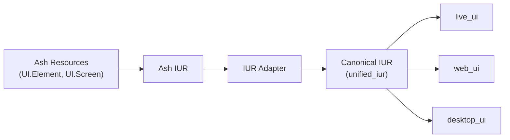
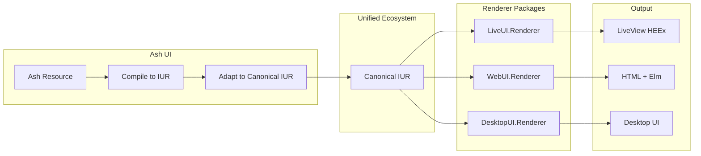

# Ash UI Rendering

This directory contains specifications for Ash UI's integration with the unified renderer packages.

## Rendering Overview

Ash UI produces canonical `unified_iur` format which is consumed by external renderer packages from the unified ecosystem.

## Architecture



## Unified Renderer Packages

### live_ui

Renders canonical IUR to Phoenix LiveView HEEx templates.

**Package**: https://github.com/your-org/unified/tree/main/packages/live_ui
**Spec**: https://github.com/your-org/unified/blob/main/.spec/specs/live_ui/iur_renderer.spec.md
**Features**:
- Reactive bindings via LiveView assigns
- Event handling via unified signal transport
- Optimized patches for updates

### web_ui

Renders canonical IUR to static HTML with optional Elm client.

**Package**: https://github.com/your-org/unified/tree/main/packages/web_ui
**Spec**: https://github.com/your-org/unified/blob/main/.spec/specs/web_ui/iur_renderer.spec.md
**Features**:
- Complete HTML5 document structure
- Phoenix server-side rendering
- Elm client-side runtime
- SEO-friendly markup

### desktop_ui

Renders canonical IUR to native desktop UI (SDL2-based).

**Package**: https://github.com/your-org/unified/tree/main/packages/desktop_ui
**Spec**: https://github.com/your-org/unified/blob/main/.spec/specs/desktop_ui/iur_renderer.spec.md
**Features**:
- Native desktop widgets
- Cross-platform (Windows, macOS, Linux)
- Unified signal transport for events

## Ash UI Components

### IUR Adapter (rendering/iur_adapter.md)

Converts Ash UI IUR to canonical unified_iur format.

**Features**:
- Resource mapping to canonical IUR schema
- Validation of IUR compatibility
- Error handling and reporting

### Renderer Registry (rendering/registry.md)

Manages available renderer packages and their capabilities.

**Features**:
- Lists available renderer packages
- Validates IUR compatibility with target renderer
- Provides renderer selection guidance

## Rendering Pipeline



## Application Usage

Applications select the renderer package to use:

```elixir
# In mix.exs - add desired renderer
def deps do
  [
    {:ash_ui, "~> 0.1"},
    {:unified_iur, "~> 0.1"},
    {:live_ui, "~> 0.1"}     # for LiveView rendering
    # or
    {:web_ui, "~> 0.1"}      # for static HTML rendering
    # or
    {:desktop_ui, "~> 0.1"}  # for desktop rendering
  ]
end

# In your application
iur = AshUI.Compilation.compile(screen)
canonical_iur = AshUI.Rendering.IURAdapter.to_canonical(iur)
LiveUI.Renderer.render(canonical_iur, [])
```

## Related Specifications

### Ash UI Specifications
- [rendering_contract.md](../contracts/rendering_contract.md)
- [compilation/](../compilation/) - IUR generation

### Unified Ecosystem Specifications
- [unified_iur](https://github.com/your-org/unified/tree/main/packages/unified_iur)
- [live_ui](https://github.com/your-org/unified/tree/main/packages/live_ui)
- [web_ui](https://github.com/your-org/unified/tree/main/packages/web_ui)
- [desktop_ui](https://github.com/your-org/unified/tree/main/packages/desktop_ui)
- [Ecosystem Architecture](https://github.com/your-org/unified/blob/main/.spec/specs/architecture.spec.md)
- [Platform Runtimes](https://github.com/your-org/unified/blob/main/.spec/specs/platform_runtimes.spec.md)
- [Signal Transport](https://github.com/your-org/unified/blob/main/.spec/specs/signal_transport.spec.md)
