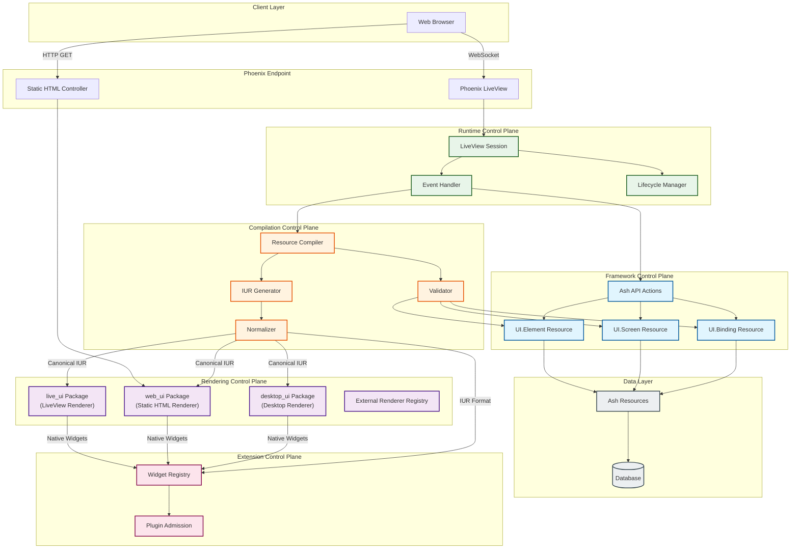
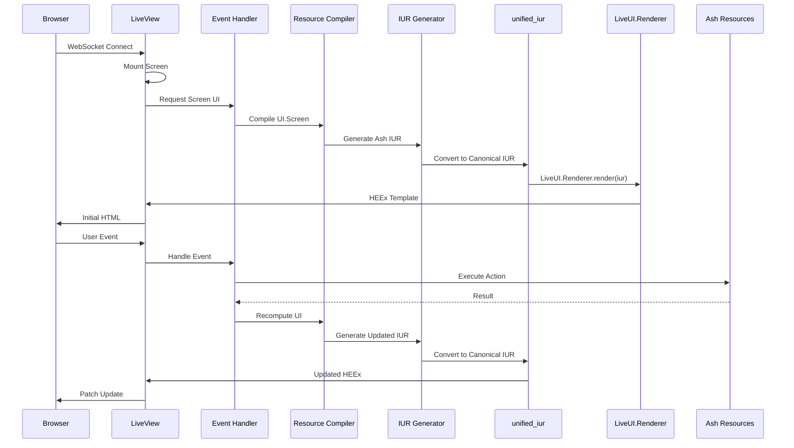
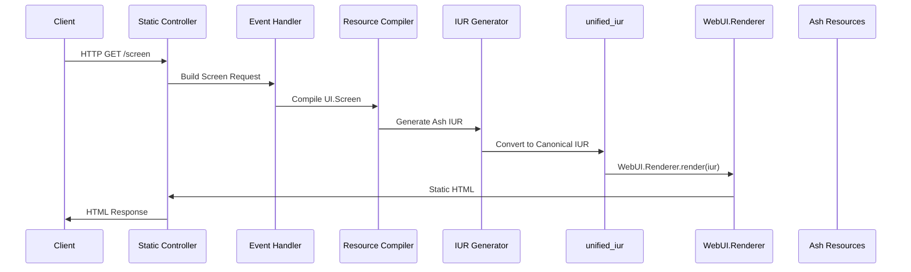

# Ash UI Topology

This document defines the canonical topology of the Ash UI framework, including supervision boundaries, service ownership, and control plane authority.

## System Overview

Ash UI is a resource-driven UI framework built on the Ash Framework for Elixir, providing dynamic UI generation from database resources through Phoenix LiveView and static web rendering.



## Supervision Tree

```mermaid
flowchart TB
    subgraph Application["AshUI.Application"]
        subgraph EndpointSup["AshUI.Endpoint"]
            PhoenixEndpoint["Phoenix.Endpoint"]
        end

        subgraph RuntimeSup["AshUI.Runtime.Supervisor"]
            SessionRegistry["Session Registry"]
            SessionSup["Session Supervisor"]
            EventDispatcher["Event Dispatcher"]
        end

        subgraph CompilationSup["AshUI.Compilation.Supervisor"]
            CompilerCache["Compiler Cache"]
            IURGenerator["IUR Generator"]
            ValidatorPool["Validator Pool"]
        end

        subgraph RenderingSup["AshUI.Rendering.Supervisor"]
            RendererRegistry["Renderer Registry"]
            PresenterSup["Presenter Supervisor"]
        end

        subgraph ExtensionSup["AshUI.Extension.Supervisor"]
            WidgetRegistry["Widget Registry"]
            PluginLoader["Plugin Loader"]
        end
    end

    PhoenixEndpoint --> SessionRegistry
    SessionRegistry --> SessionSup
    SessionSup --> EventDispatcher

    EventDispatcher --> CompilerCache
    CompilerCache --> IURGenerator

    IURGenerator --> RendererRegistry
    RendererRegistry --> PresenterSup

    PresenterSup --> WidgetRegistry
    WidgetRegistry --> PluginLoader
```



## Control Plane Authority

### Framework Control Plane

**Owner**: `AshUI.Framework`

**Scope**: Core Ash Resource definitions, type system, action semantics

**Components**:
- `Ash.UI.Element` - Atomic UI component definitions
- `Ash.UI.Screen` - Screen/page composition and lifecycle
- `Ash.UI.Binding` - Data binding and event wiring

**Authority**:
- Defines resource schemas and attributes
- Establishes Ash action contracts (create, read, update, destroy)
- Controls validation rules and change tracking
- Owns the type system for UI components

### Compilation Control Plane

**Owner**: `AshUI.Compilation`

**Scope**: Resource → IUR transformation pipeline

**Components**:
- Resource Compiler - Validates and compiles Ash resources
- IUR Generator - Produces Intermediate UI Representation
- Validator - Schema and constraint validation
- Normalizer - Standardizes representation

**Authority**:
- Defines compilation stages and their ordering
- Controls validation rules and error reporting
- Manages compiler cache and invalidation
- Owns the IUR schema

### Rendering Control Plane

**Owner**: `AshUI.Rendering`

**Scope**: Output generation for target platforms via external renderer packages

**Components**:
- **live_ui** - External package providing LiveView-compatible rendering via `LiveUI.Renderer.render/2`
- **web_ui** - External package providing static HTML rendering via `WebUI.Renderer.render/2`
- **desktop_ui** - External package providing desktop rendering via `DesktopUI.Renderer.render/2`
- **Renderer Registry** - Manages renderer package selection and adapter registration

**Authority**:
- Compiles Ash Resources to canonical unified_iur format
- Delegates rendering to external unified renderer packages
- Manages renderer package selection and routing
- Validates IUR compatibility with target renderers

**External Dependencies**:
- `unified_iur` - Canonical intermediate representation format
- Renderer packages are consumed as dependencies, not owned by Ash UI

### Runtime Control Plane

**Owner**: `AshUI.Runtime`

**Scope**: Session lifecycle and event handling

**Components**:
- LiveView Session Management
- Event Handler - User interaction processing
- Lifecycle Manager - Mount/unmount/hooks

**Authority**:
- Defines session lifecycle contracts
- Controls event routing and handling
- Manages state synchronization
- Owns the LiveView integration points

### Extension Control Plane

**Owner**: `AshUI.Extension`

**Scope**: Custom widgets, plugins, and third-party extensions

**Components**:
- Widget Registry - Custom component registration
- Plugin Admission - Extension validation and loading

**Authority**:
- Defines extension contracts and interfaces
- Controls plugin admission and sandboxing
- Manages widget lifecycle and dependencies
- Owns the extension API

## Data Flow

### Request Flow (LiveView)



### Request Flow (Static)



## Module Namespace Hierarchy

```
AshUI                               # Application root
├── Application                     # OTP Application
├── Framework                       # Framework Control Plane
│   ├── Element                     # UI.Element Resource
│   ├── Screen                      # UI.Screen Resource
│   └── Binding                     # UI.Binding Resource
├── Compilation                     # Compilation Control Plane
│   ├── Compiler                    # Resource → IUR Compiler
│   ├── IUR                         # Intermediate UI Representation
│   ├── Validator                   # Schema Validator
│   └── Normalizer                  # Representation Normalizer
├── Rendering                       # Rendering Control Plane
│   ├── IURAdapter                  # Ash IUR → unified_iur adapter
│   └── RendererRegistry            # External renderer package management
├── Runtime                         # Runtime Control Plane
│   ├── Session                     # Session Management
│   ├── EventHandler                # Event Processing
│   └── Lifecycle                   # Lifecycle Hooks
└── Extension                       # Extension Control Plane
    ├── WidgetRegistry              # Widget Registration
    └── PluginAdmission             # Plugin Admission
```

## Service Dependencies

### Framework Dependencies
- Ash Framework (Core, API, JsonApi)
- Phoenix LiveView
- Ecto

### Compilation Dependencies
- Ash (Resource DSL)
- Phoenix.Template (for HEEx)

### Rendering Dependencies
- `unified_iur` - Canonical intermediate representation
- `live_ui` - LiveView rendering (optional, application-provided)
- `web_ui` - Static HTML rendering (optional, application-provided)
- `desktop_ui` - Desktop rendering (optional, application-provided)

### Runtime Dependencies
- Phoenix.LiveView
- Phoenix.PubSub

## Ownership Matrix

See [contracts/control_plane_ownership_matrix.md](contracts/control_plane_ownership_matrix.md) for detailed ownership of all components.

## Versioning

The topology version is tracked in the Application module:

```elixir
defmodule AshUI.Application do
  @moduledoc """
  AshUI Application v0.1.0
  Topology Version: 1.0.0
  """
end
```

## Related Specifications

- [Framework Control Plane: resource_contract.md](contracts/resource_contract.md)
- [Compilation Control Plane: compilation_contract.md](contracts/compilation_contract.md)
- [Rendering Control Plane: rendering_contract.md](contracts/rendering_contract.md)
- [Runtime Control Plane: screen_contract.md](contracts/screen_contract.md)
